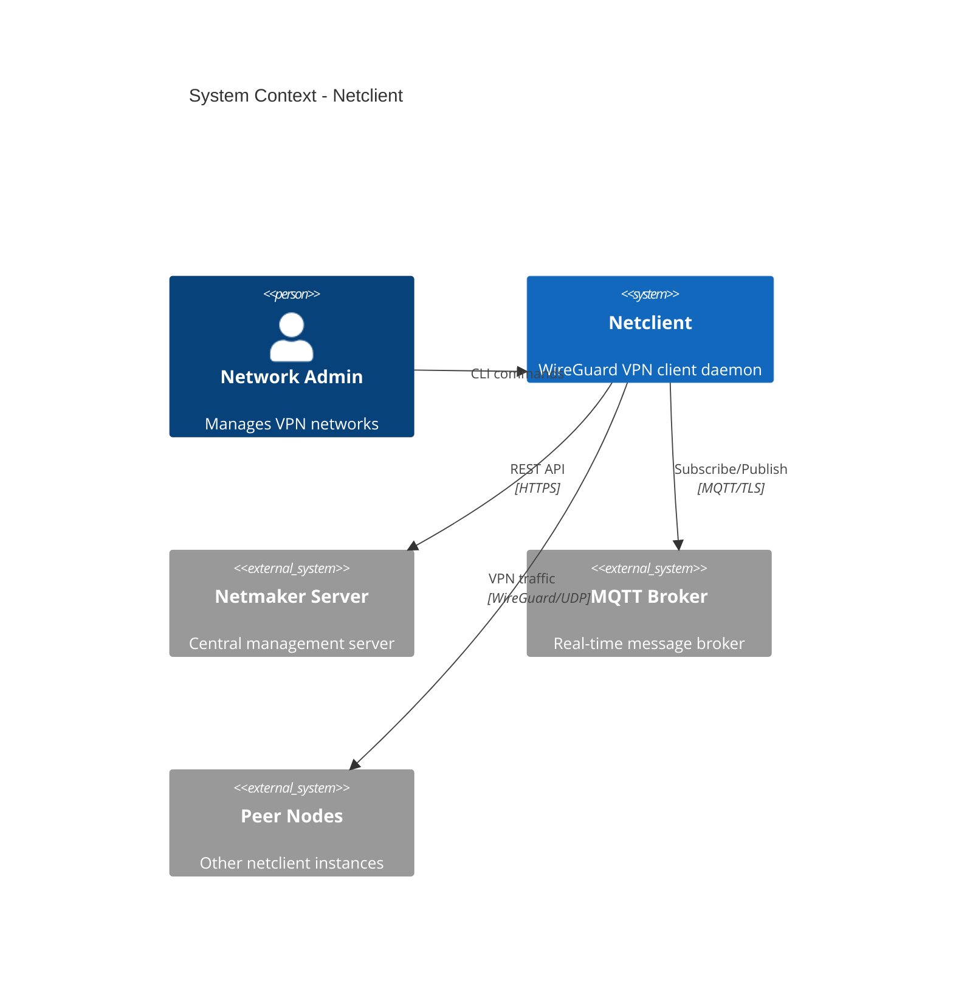
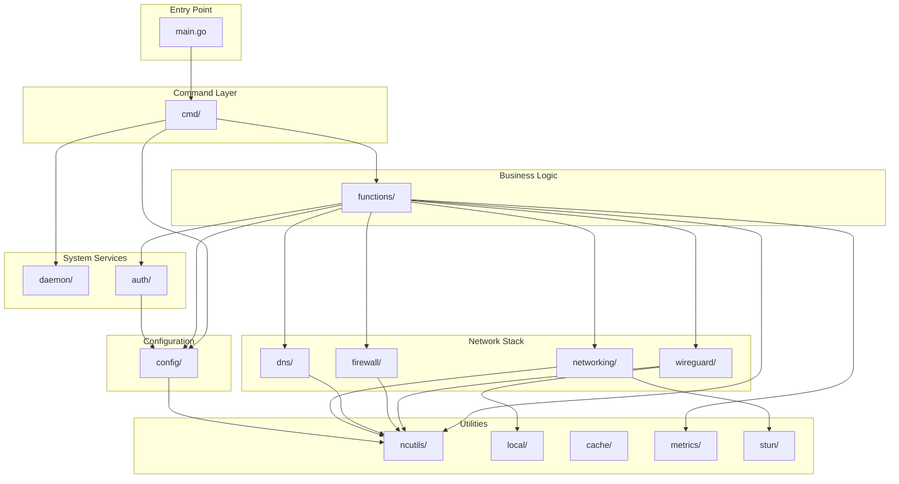

# Architecture

This document provides a detailed architectural overview of the Netclient application.

## System Context Diagram



## Component Architecture

```
┌─────────────────────────────────────────────────────────────────────────────────┐
│                                   NETCLIENT                                      │
├─────────────────────────────────────────────────────────────────────────────────┤
│                                                                                  │
│  ┌─────────────────────────────────────────────────────────────────────────┐    │
│  │                           CLI LAYER (cmd/)                               │    │
│  │  ┌─────────┐ ┌─────────┐ ┌─────────┐ ┌─────────┐ ┌─────────┐           │    │
│  │  │  join   │ │ daemon  │ │ connect │ │  leave  │ │  pull   │  ...      │    │
│  │  └────┬────┘ └────┬────┘ └────┬────┘ └────┬────┘ └────┬────┘           │    │
│  └───────┼──────────┼──────────┼──────────┼──────────┼─────────────────────┘    │
│          │          │          │          │          │                           │
│          ▼          ▼          ▼          ▼          ▼                           │
│  ┌─────────────────────────────────────────────────────────────────────────┐    │
│  │                       FUNCTIONS LAYER (functions/)                       │    │
│  │                                                                          │    │
│  │  ┌────────────────┐  ┌────────────────┐  ┌────────────────┐             │    │
│  │  │   daemon.go    │  │ mqhandlers.go  │  │  register.go   │             │    │
│  │  │                │  │                │  │                │             │    │
│  │  │ - Main loop    │  │ - NodeUpdate   │  │ - Token auth   │             │    │
│  │  │ - Goroutines   │  │ - DNSSync      │  │ - SSO flow     │             │    │
│  │  │ - Signal hdlr  │  │ - ACLUpdate    │  │ - Host setup   │             │    │
│  │  └────────────────┘  └────────────────┘  └────────────────┘             │    │
│  │                                                                          │    │
│  │  ┌────────────────┐  ┌────────────────┐  ┌────────────────┐             │    │
│  │  │  mqpublish.go  │  │  auto_relay.go │  │    peers.go    │             │    │
│  │  │                │  │                │  │                │             │    │
│  │  │ - Pub signals  │  │ - Relay select │  │ - Peer info    │             │    │
│  │  │ - Pub metrics  │  │ - Latency test │  │ - WG stats     │             │    │
│  │  │ - Node update  │  │ - NAT traverse │  │ - Formatting   │             │    │
│  │  └────────────────┘  └────────────────┘  └────────────────┘             │    │
│  └─────────────────────────────────────────────────────────────────────────┘    │
│                                      │                                           │
│          ┌───────────────────────────┼───────────────────────────┐              │
│          ▼                           ▼                           ▼              │
│  ┌──────────────┐           ┌──────────────┐           ┌──────────────┐         │
│  │   CONFIG     │           │   DAEMON     │           │    AUTH      │         │
│  │  (config/)   │           │  (daemon/)   │           │   (auth/)    │         │
│  │              │           │              │           │              │         │
│  │ - Host cfg   │           │ - systemd    │           │ - JWT tokens │         │
│  │ - Node cfg   │           │ - sysvinit   │           │ - Host auth  │         │
│  │ - Server cfg │           │ - launchd    │           │ - Validation │         │
│  │ - Atomic I/O │           │ - Win svc    │           │              │         │
│  └──────────────┘           └──────────────┘           └──────────────┘         │
│          │                           │                           │              │
│          └───────────────────────────┼───────────────────────────┘              │
│                                      ▼                                           │
│  ┌─────────────────────────────────────────────────────────────────────────┐    │
│  │                     SYSTEM INTEGRATION LAYER                             │    │
│  │                                                                          │    │
│  │  ┌────────────┐  ┌────────────┐  ┌────────────┐  ┌────────────┐         │    │
│  │  │ wireguard/ │  │ firewall/  │  │    dns/    │  │   local/   │         │    │
│  │  │            │  │            │  │            │  │            │         │    │
│  │  │ - NCIface  │  │ - nftables │  │ - Resolver │  │ - IP fwd   │         │    │
│  │  │ - wgctrl   │  │ - iptables │  │ - Listener │  │ - Routes   │         │    │
│  │  │ - Peers    │  │ - ACLs     │  │ - Config   │  │ - sysctls  │         │    │
│  │  └────────────┘  └────────────┘  └────────────┘  └────────────┘         │    │
│  └─────────────────────────────────────────────────────────────────────────┘    │
│                                      │                                           │
│                                      ▼                                           │
│  ┌─────────────────────────────────────────────────────────────────────────┐    │
│  │                          UTILITIES (ncutils/)                            │    │
│  │   Interface mgmt | Port allocation | STUN | Random gen | File ops       │    │
│  └─────────────────────────────────────────────────────────────────────────┘    │
│                                                                                  │
└─────────────────────────────────────────────────────────────────────────────────┘
```

## Package Dependency Graph



## Data Flow Architecture

```
                                    ┌─────────────────────┐
                                    │   NETMAKER SERVER   │
                                    │                     │
                                    │  ┌───────────────┐  │
                                    │  │   REST API    │  │
                                    │  └───────┬───────┘  │
                                    │          │          │
                                    │  ┌───────▼───────┐  │
                                    │  │  MQTT Broker  │  │
                                    │  └───────┬───────┘  │
                                    └──────────┼──────────┘
                                               │
                           ┌───────────────────┴───────────────────┐
                           │         MQTT Messages                  │
                           │                                        │
              ┌────────────▼────────────┐              ┌───────────▼───────────┐
              │      INBOUND TOPICS     │              │    OUTBOUND TOPICS    │
              │                         │              │                       │
              │ • host/{id}/update/*    │              │ • host/{id}/signal/*  │
              │ • host/{id}/dns/sync    │              │ • host/{id}/metrics/* │
              │ • host/{id}/acl/*       │              │                       │
              └────────────┬────────────┘              └───────────▲───────────┘
                           │                                       │
                           ▼                                       │
              ┌─────────────────────────────────────────────────────────────────┐
              │                        MQ HANDLERS                               │
              │                                                                  │
              │  ┌──────────────┐  ┌──────────────┐  ┌──────────────┐           │
              │  │  NodeUpdate  │  │   DNSSync    │  │  ACLUpdate   │           │
              │  │              │  │              │  │              │           │
              │  │ 1. Decrypt   │  │ 1. Parse DNS │  │ 1. Parse ACL │           │
              │  │ 2. Decompress│  │ 2. Update    │  │ 2. Update    │           │
              │  │ 3. Parse     │  │    resolver  │  │    firewall  │           │
              │  │ 4. Apply     │  │              │  │              │           │
              │  └──────┬───────┘  └──────┬───────┘  └──────┬───────┘           │
              │         │                 │                 │                    │
              └─────────┼─────────────────┼─────────────────┼────────────────────┘
                        │                 │                 │
                        ▼                 ▼                 ▼
              ┌─────────────────────────────────────────────────────────────────┐
              │                     SYSTEM INTEGRATION                           │
              │                                                                  │
              │  ┌──────────────┐  ┌──────────────┐  ┌──────────────┐           │
              │  │  WireGuard   │  │     DNS      │  │   Firewall   │           │
              │  │  Interface   │  │   Resolver   │  │    Rules     │           │
              │  │              │  │              │  │              │           │
              │  │ • Peers      │  │ • A records  │  │ • ACL chains │           │
              │  │ • Endpoints  │  │ • Upstreams  │  │ • NAT rules  │           │
              │  │ • Keys       │  │ • Search dom │  │ • Forwarding │           │
              │  └──────────────┘  └──────────────┘  └──────────────┘           │
              │                                                                  │
              └─────────────────────────────────────────────────────────────────┘
```

## Runtime Architecture

```
┌─────────────────────────────────────────────────────────────────────────────────┐
│                              DAEMON RUNTIME                                      │
├─────────────────────────────────────────────────────────────────────────────────┤
│                                                                                  │
│   Main Goroutine                                                                 │
│   ┌──────────────────────────────────────────────────────────────────────────┐  │
│   │                                                                          │  │
│   │  1. InitConfig()           5. Start MQTT Client                          │  │
│   │  2. Verify UID (root)      6. Subscribe to Topics                        │  │
│   │  3. Remove Lock Files      7. Start Background Goroutines                │  │
│   │  4. Migrate Configs        8. Wait for Signals                           │  │
│   │                                                                          │  │
│   └──────────────────────────────────────────────────────────────────────────┘  │
│                                                                                  │
│   Background Goroutines                                                          │
│   ┌─────────────────┐  ┌─────────────────┐  ┌─────────────────┐                 │
│   │  MQTT Handler   │  │  Metrics Loop   │  │   Ping Loop     │                 │
│   │                 │  │                 │  │                 │                 │
│   │ • Receive msgs  │  │ • Collect stats │  │ • Check peers   │                 │
│   │ • Route to      │  │ • Report to     │  │ • Measure RTT   │                 │
│   │   handlers      │  │   server        │  │ • Update cache  │                 │
│   │ • Update state  │  │ • Every 5 min   │  │ • Every 30 sec  │                 │
│   └─────────────────┘  └─────────────────┘  └─────────────────┘                 │
│                                                                                  │
│   ┌─────────────────┐  ┌─────────────────┐  ┌─────────────────┐                 │
│   │  Relay Checker  │  │   DNS Server    │  │  Signal Handler │                 │
│   │                 │  │                 │  │                 │                 │
│   │ • Test relays   │  │ • Listen :53    │  │ • SIGTERM       │                 │
│   │ • Select best   │  │ • Resolve names │  │ • SIGHUP        │                 │
│   │ • Update peers  │  │ • Forward ext   │  │ • Graceful stop │                 │
│   └─────────────────┘  └─────────────────┘  └─────────────────┘                 │
│                                                                                  │
├─────────────────────────────────────────────────────────────────────────────────┤
│   Shared State (Thread-Safe via RWMutex)                                         │
│   ┌────────────────────────────────────────────────────────────────────────────┐│
│   │  Config        NodeMap        ServerMap       InterfaceCache              ││
│   │  (config.go)   (node.go)      (server.go)     (cache/iface_cache.go)      ││
│   └────────────────────────────────────────────────────────────────────────────┘│
└─────────────────────────────────────────────────────────────────────────────────┘
```

## WireGuard Integration Architecture

```
┌─────────────────────────────────────────────────────────────────────────────────┐
│                           WIREGUARD INTEGRATION                                  │
├─────────────────────────────────────────────────────────────────────────────────┤
│                                                                                  │
│  ┌─────────────────────────────────────────────────────────────────────────┐    │
│  │                         NCIface (types.go)                               │    │
│  │                                                                          │    │
│  │  ┌──────────────┐  ┌──────────────┐  ┌──────────────┐                   │    │
│  │  │  Name: nm-*  │  │  Addresses   │  │   wg.Config  │                   │    │
│  │  │  MTU: 1420   │  │  10.x.x.x/24 │  │  PrivateKey  │                   │    │
│  │  │              │  │  fd::/64     │  │  ListenPort  │                   │    │
│  │  │              │  │              │  │  Peers []    │                   │    │
│  │  └──────────────┘  └──────────────┘  └──────────────┘                   │    │
│  └─────────────────────────────────────────────────────────────────────────┘    │
│                                      │                                           │
│                                      ▼                                           │
│  ┌─────────────────────────────────────────────────────────────────────────┐    │
│  │                      Platform Implementations                            │    │
│  │                                                                          │    │
│  │  ┌──────────────────┐  ┌──────────────────┐  ┌──────────────────┐       │    │
│  │  │      Linux       │  │      macOS       │  │     Windows      │       │    │
│  │  │                  │  │                  │  │                  │       │    │
│  │  │ • netlink API    │  │ • utun device    │  │ • WinTun driver  │       │    │
│  │  │ • wgctrl-go      │  │ • wgctrl-go      │  │ • WireGuard.exe  │       │    │
│  │  │ • iproute2       │  │ • route cmd      │  │ • WinAPI routes  │       │    │
│  │  └──────────────────┘  └──────────────────┘  └──────────────────┘       │    │
│  └─────────────────────────────────────────────────────────────────────────┘    │
│                                      │                                           │
│                                      ▼                                           │
│  ┌─────────────────────────────────────────────────────────────────────────┐    │
│  │                         Kernel/Driver Layer                              │    │
│  │                                                                          │    │
│  │  ┌──────────────────────────────────────────────────────────────────┐   │    │
│  │  │                    WireGuard Kernel Module                        │   │    │
│  │  │                                                                   │   │    │
│  │  │   • Cryptographic handshake (Noise Protocol)                      │   │    │
│  │  │   • UDP encapsulation/decapsulation                               │   │    │
│  │  │   • Peer authentication via public keys                           │   │    │
│  │  │   • Automatic key rotation                                        │   │    │
│  │  │                                                                   │   │    │
│  │  └──────────────────────────────────────────────────────────────────┘   │    │
│  └─────────────────────────────────────────────────────────────────────────┘    │
│                                                                                  │
└─────────────────────────────────────────────────────────────────────────────────┘
```

## Security Architecture

```
┌─────────────────────────────────────────────────────────────────────────────────┐
│                            SECURITY ARCHITECTURE                                 │
├─────────────────────────────────────────────────────────────────────────────────┤
│                                                                                  │
│  ┌────────────────────────────────────────────────────────────────────────┐     │
│  │                        TRANSPORT SECURITY                               │     │
│  │                                                                         │     │
│  │  ┌─────────────────┐  ┌─────────────────┐  ┌─────────────────┐         │     │
│  │  │  REST API       │  │  MQTT           │  │  WireGuard      │         │     │
│  │  │  HTTPS/TLS 1.3  │  │  TLS 1.3        │  │  Noise Protocol │         │     │
│  │  └─────────────────┘  └─────────────────┘  └─────────────────┘         │     │
│  └────────────────────────────────────────────────────────────────────────┘     │
│                                                                                  │
│  ┌────────────────────────────────────────────────────────────────────────┐     │
│  │                        MESSAGE SECURITY                                 │     │
│  │                                                                         │     │
│  │  MQTT Payload Processing:                                               │     │
│  │  ┌─────────────┐    ┌─────────────┐    ┌─────────────┐                 │     │
│  │  │  Encrypted  │───▶│  AES-GCM    │───▶│ Decompressed│                 │     │
│  │  │  + GZIP     │    │  Decrypt    │    │    JSON     │                 │     │
│  │  └─────────────┘    └─────────────┘    └─────────────┘                 │     │
│  │                                                                         │     │
│  │  Fallback: RSA decryption for legacy compatibility                      │     │
│  └────────────────────────────────────────────────────────────────────────┘     │
│                                                                                  │
│  ┌────────────────────────────────────────────────────────────────────────┐     │
│  │                        AUTHENTICATION                                   │     │
│  │                                                                         │     │
│  │  ┌─────────────────────────────────────────────────────────────────┐   │     │
│  │  │  Host Authentication (auth/auth.go)                              │   │     │
│  │  │                                                                  │   │     │
│  │  │  Credentials:                                                    │   │     │
│  │  │  • Host ID (UUID)                                                │   │     │
│  │  │  • MAC Address                                                   │   │     │
│  │  │  • Host Password (32-char random string)                         │   │     │
│  │  │                                                                  │   │     │
│  │  │  Flow:                                                           │   │     │
│  │  │  1. POST /api/hosts/adm/authenticate                             │   │     │
│  │  │  2. Receive JWT token                                            │   │     │
│  │  │  3. Cache token with expiration                                  │   │     │
│  │  │  4. Use token in Authorization header                            │   │     │
│  │  └─────────────────────────────────────────────────────────────────┘   │     │
│  └────────────────────────────────────────────────────────────────────────┘     │
│                                                                                  │
│  ┌────────────────────────────────────────────────────────────────────────┐     │
│  │                        KEY MANAGEMENT                                   │     │
│  │                                                                         │     │
│  │  ┌─────────────────────────┐  ┌─────────────────────────┐              │     │
│  │  │  WireGuard Keys         │  │  Traffic Keys           │              │     │
│  │  │                         │  │                         │              │     │
│  │  │  • Ed25519 key pair     │  │  • NaCl Box (Curve25519)│              │     │
│  │  │  • 256-bit private key  │  │  • Peer-to-peer encrypt │              │     │
│  │  │  • Public key exchange  │  │  • Auto-rotated         │              │     │
│  │  └─────────────────────────┘  └─────────────────────────┘              │     │
│  └────────────────────────────────────────────────────────────────────────┘     │
│                                                                                  │
└─────────────────────────────────────────────────────────────────────────────────┘
```

## Network Topology Modes

```
┌─────────────────────────────────────────────────────────────────────────────────┐
│                           NETWORK TOPOLOGY MODES                                 │
├─────────────────────────────────────────────────────────────────────────────────┤
│                                                                                  │
│  1. DIRECT MESH (No NAT)                                                         │
│  ┌────────────────────────────────────────────────────────────────────────┐     │
│  │                                                                         │     │
│  │       Node A ◄──────────────── WireGuard ──────────────────► Node B    │     │
│  │         │                                                        │      │     │
│  │         │                                                        │      │     │
│  │         └──────────────────── WireGuard ─────────────────────────┘      │     │
│  │                                    │                                    │     │
│  │                                    ▼                                    │     │
│  │                                 Node C                                  │     │
│  │                                                                         │     │
│  └────────────────────────────────────────────────────────────────────────┘     │
│                                                                                  │
│  2. RELAYED MESH (Behind NAT)                                                    │
│  ┌────────────────────────────────────────────────────────────────────────┐     │
│  │                                                                         │     │
│  │       Node A                    Relay Node                    Node B    │     │
│  │    (behind NAT)                 (public IP)               (behind NAT) │     │
│  │         │                           │                           │      │     │
│  │         │                           │                           │      │     │
│  │         └────── WireGuard ─────────►│◄────── WireGuard ─────────┘      │     │
│  │                                     │                                   │     │
│  │                             Relay forwards                              │     │
│  │                           encrypted packets                             │     │
│  │                                                                         │     │
│  └────────────────────────────────────────────────────────────────────────┘     │
│                                                                                  │
│  3. EGRESS GATEWAY (External Network Access)                                     │
│  ┌────────────────────────────────────────────────────────────────────────┐     │
│  │                                                                         │     │
│  │    VPN Clients              Egress Gateway             External Network │     │
│  │         │                        │                           │          │     │
│  │  ┌──────┴──────┐          ┌──────┴──────┐           ┌────────┴───────┐ │     │
│  │  │ 10.10.0.0/24│─────────►│ NAT + Route │──────────►│ 192.168.1.0/24 │ │     │
│  │  └─────────────┘          │  Forwarding │           └────────────────┘ │     │
│  │                           └─────────────┘                               │     │
│  │                                                                         │     │
│  └────────────────────────────────────────────────────────────────────────┘     │
│                                                                                  │
│  4. INGRESS GATEWAY (Expose Internal Services)                                   │
│  ┌────────────────────────────────────────────────────────────────────────┐     │
│  │                                                                         │     │
│  │    External Clients         Ingress Gateway          Internal Services  │     │
│  │         │                        │                           │          │     │
│  │  ┌──────┴──────┐          ┌──────┴──────┐           ┌────────┴───────┐ │     │
│  │  │   Internet  │─────────►│   DNAT +    │──────────►│  Web Server    │ │     │
│  │  └─────────────┘          │   Proxy     │           │  Database      │ │     │
│  │                           └─────────────┘           │  API Server    │ │     │
│  │                                                     └────────────────┘ │     │
│  └────────────────────────────────────────────────────────────────────────┘     │
│                                                                                  │
└─────────────────────────────────────────────────────────────────────────────────┘
```

## Related Documentation

- [Workflows](Workflows) - Detailed swimlane diagrams
- [System Integration](System-Integration) - OS-level integration details
- [Components](Components) - Package breakdown
- [Configuration](Configuration) - Config file formats
