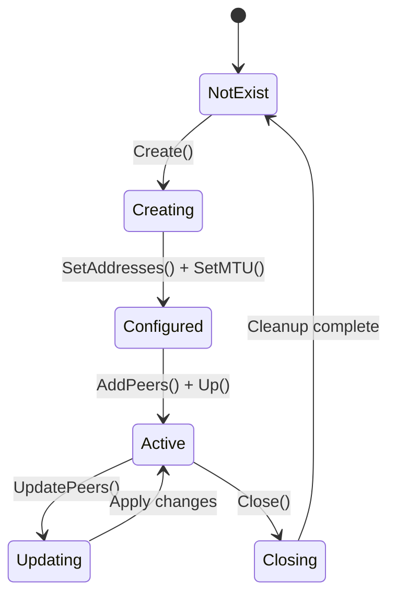

# Components

This document provides a detailed breakdown of Netclient's packages and their responsibilities.

## Package Overview

```
┌─────────────────────────────────────────────────────────────────────────────────┐
│                            NETCLIENT PACKAGES                                    │
├─────────────────────────────────────────────────────────────────────────────────┤
│                                                                                  │
│   ┌─────────────┐                                                                │
│   │   main.go   │  Entry point                                                   │
│   └──────┬──────┘                                                                │
│          │                                                                       │
│          ▼                                                                       │
│   ┌─────────────┐                                                                │
│   │    cmd/     │  CLI commands (Cobra)                                          │
│   └──────┬──────┘                                                                │
│          │                                                                       │
│          ├─────────────────────────────────────────────┐                        │
│          ▼                                             ▼                        │
│   ┌─────────────┐                               ┌─────────────┐                 │
│   │ functions/  │  Business logic               │   daemon/   │  Init systems   │
│   └──────┬──────┘                               └─────────────┘                 │
│          │                                                                       │
│          ├──────────────┬──────────────┬──────────────┬──────────────┐          │
│          ▼              ▼              ▼              ▼              ▼          │
│   ┌───────────┐  ┌───────────┐  ┌───────────┐  ┌───────────┐  ┌───────────┐    │
│   │  config/  │  │ wireguard/│  │ firewall/ │  │   dns/    │  │   auth/   │    │
│   └───────────┘  └───────────┘  └───────────┘  └───────────┘  └───────────┘    │
│                                                                                  │
│   ┌───────────┐  ┌───────────┐  ┌───────────┐  ┌───────────┐  ┌───────────┐    │
│   │ ncutils/  │  │   local/  │  │ networking│  │  metrics/ │  │   stun/   │    │
│   └───────────┘  └───────────┘  └───────────┘  └───────────┘  └───────────┘    │
│                                                                                  │
└─────────────────────────────────────────────────────────────────────────────────┘
```

---

## cmd/ - Command Layer

The CLI layer built on [Cobra](https://github.com/spf13/cobra). Handles user input and delegates to the functions layer.

### Files

| File | Description |
|------|-------------|
| `root.go` | Root command, config initialization, logging setup |
| `join.go` | Join network with token/SSO/basic auth |
| `register.go` | Register host with Netmaker server |
| `daemon.go` | Start the netclient daemon |
| `connect.go` | Connect to a network |
| `disconnect.go` | Disconnect from a network |
| `leave.go` | Leave a network completely |
| `list.go` | List joined networks |
| `peers.go` | Display peer information |
| `ping.go` | Test peer connectivity |
| `pull.go` | Fetch latest configuration |
| `push.go` | Push local updates to server |
| `install.go` | Install system daemon |
| `uninstall.go` | Remove daemon and cleanup |
| `server.go` | Server management |
| `use.go` | Switch server context |
| `version.go` | Display version info |

### Command Hierarchy

```
netclient
├── join        [-t token] [-n network]
├── register    [-t token]
├── daemon
├── connect     [-n network]
├── disconnect  [-n network]
├── leave       [-n network]
├── list
├── peers       [-n network]
├── ping        [peer-name]
├── pull        [-n network]
├── push        [-n network]
├── install
├── uninstall
├── server
│   ├── list
│   ├── switch  [server-name]
│   └── leave   [server-name]
├── use         [version]
└── version
```

---

## functions/ - Business Logic Layer

Core business logic for all netclient operations.

### Key Files

#### daemon.go

Main daemon loop and goroutine management.

```go
func Daemon() error {
    // 1. Initialize configuration
    // 2. Setup MQTT connection
    // 3. Start background goroutines:
    //    - MQTT subscriber
    //    - Metrics collector
    //    - Ping routine
    //    - Relay checker
    // 4. Setup signal handlers
    // 5. Wait for shutdown
}
```

**Responsibilities:**
- Main event loop
- Goroutine lifecycle
- Signal handling (SIGTERM, SIGHUP)
- Graceful shutdown

#### mqhandlers.go

MQTT message handlers - the backbone of real-time updates.

```go
// Message handlers
func NodeUpdate(...)      // Handle node configuration updates
func DNSSync(...)         // DNS entry synchronization
func ACLUpdate(...)       // Access control list changes
func EgressUpdate(...)    // Egress gateway updates
func IngressUpdate(...)   // Ingress gateway updates
func RelayUpdate(...)     // Relay configuration
```

**Message Processing Pipeline:**

```
┌───────────┐   ┌───────────┐   ┌───────────┐   ┌───────────┐   ┌───────────┐
│  Receive  │──▶│  Decrypt  │──▶│Decompress │──▶│   Parse   │──▶│   Apply   │
│  Message  │   │  AES-GCM  │   │   GZIP    │   │   JSON    │   │  Changes  │
└───────────┘   └───────────┘   └───────────┘   └───────────┘   └───────────┘
```

#### mqpublish.go

Outbound MQTT message publishing.

```go
func PublishSignal(...)     // Send completion signals
func PublishNodeUpdate(...) // Push node changes
func PublishMetrics(...)    // Send performance metrics
```

#### register.go

Host registration with Netmaker server.

```go
func Register(token string) error {
    // 1. Decode base64 token envelope
    // 2. Extract server URL and credentials
    // 3. Discover local interfaces
    // 4. POST to /api/v1/host/register/{token}
    // 5. Handle response and save config
}
```

#### auto_relay.go

Intelligent relay node selection.

```go
func CheckRelays() {
    // 1. Get available relay nodes
    // 2. Measure latency to each
    // 3. Select optimal relay
    // 4. Update peer configuration
}
```

**Selection Algorithm:**

```
┌─────────────────────────────────────────────────────────────────────────────────┐
│                                                                                  │
│   for each network:                                                              │
│       relays = getAvailableRelays(network)                                       │
│       for each relay in relays:                                                  │
│           latency = measureLatency(relay.endpoint)                               │
│           if latency < bestLatency:                                              │
│               bestRelay = relay                                                  │
│                                                                                  │
│       if bestRelay != currentRelay:                                              │
│           switchToRelay(bestRelay)                                               │
│                                                                                  │
└─────────────────────────────────────────────────────────────────────────────────┘
```

#### peers.go

Peer information gathering and formatting.

```go
func GetPeers(network string) ([]Peer, error) {
    // 1. Query WireGuard interface for peer stats
    // 2. Correlate with server metadata
    // 3. Calculate connectivity status
    // 4. Format output (JSON or text)
}
```

#### ping.go

Connectivity metrics collection.

```go
func PingPeer(peer Peer) PingResult {
    // Internal nodes: TCP ping
    // External clients: ICMP ping
}
```

#### encryption.go

Message decryption utilities.

```go
func DecryptMessage(payload []byte) ([]byte, error) {
    // 1. Try AES-GCM decryption
    // 2. Fallback to RSA for legacy
    // 3. GZIP decompress
    // 4. Return plaintext JSON
}
```

---

## config/ - Configuration Management

Persistent state and settings with thread-safe access.

### Files

| File | Description |
|------|-------------|
| `config.go` | Host configuration (Config struct) |
| `node.go` | Node configuration per network |
| `server.go` | Server configuration |
| `oldconfig.go` | Legacy format migration |
| `config_linux.go` | Linux-specific paths |
| `config_darwin.go` | macOS-specific paths |
| `config_windows.go` | Windows-specific paths |

### Data Structures

```go
// Host configuration
type Config struct {
    models.Host
    PrivateKey        wgtypes.Key  // WireGuard private key
    TrafficKeyPrivate []byte       // NaCl Box private key
    InitType          InitType     // systemd, sysvinit, etc.
    DNSManagerType    string       // resolved, resolvconf, etc.
    NameServers       []string     // Custom nameservers
    CurrGwNmIP        net.IP       // Internet gateway IP
}

// Per-network node configuration
type Node struct {
    models.CommonNode
    Network     string
    Address     string
    Connected   bool
    IsEgress    bool
    IsIngress   bool
    IsRelay     bool
}

// Server configuration
type Server struct {
    models.ServerConfig
    Name           string
    MQID           uuid.UUID
    AccessKey      string
    DnsNameservers []models.Nameserver
}
```

### Thread Safety

```
┌─────────────────────────────────────────────────────────────────────────────────┐
│                        THREAD-SAFE CONFIGURATION                                 │
├─────────────────────────────────────────────────────────────────────────────────┤
│                                                                                  │
│   All config operations protected by RWMutex:                                    │
│                                                                                  │
│   ┌─────────────────────────────────────────────────────────────────────────┐   │
│   │                                                                         │   │
│   │   Read Operations (RLock):                                              │   │
│   │   ├── GetConfig()                                                       │   │
│   │   ├── GetNode(network)                                                  │   │
│   │   └── GetServer(name)                                                   │   │
│   │                                                                         │   │
│   │   Write Operations (Lock):                                              │   │
│   │   ├── WriteNetclientConfig()                                            │   │
│   │   ├── WriteNodeConfig()                                                 │   │
│   │   └── WriteServerConfig()                                               │   │
│   │                                                                         │   │
│   │   Deadlock Detection:                                                   │   │
│   │   └── Timeout-based detection with logging                              │   │
│   │                                                                         │   │
│   └─────────────────────────────────────────────────────────────────────────┘   │
│                                                                                  │
│   Atomic File Writes:                                                            │
│   ┌─────────────────────────────────────────────────────────────────────────┐   │
│   │   1. Write to temp file                                                 │   │
│   │   2. Sync to disk                                                       │   │
│   │   3. Rename (atomic on POSIX)                                           │   │
│   └─────────────────────────────────────────────────────────────────────────┘   │
│                                                                                  │
└─────────────────────────────────────────────────────────────────────────────────┘
```

---

## wireguard/ - WireGuard Integration

Interface management and peer configuration.

### Files

| File | Description |
|------|-------------|
| `types.go` | NCIface struct and address types |
| `wireguard.go` | Interface lifecycle management |
| `wireguard_linux.go` | Linux implementation (netlink) |
| `wireguard_darwin.go` | macOS implementation |
| `wireguard_freebsd.go` | FreeBSD implementation |
| `wireguard_windows.go` | Windows implementation (WinTun) |
| `egress.go` | Egress gateway functionality |
| `igw.go` | Internet gateway features |
| `modprobe_linux.go` | Kernel module management |

### NCIface Structure

```go
type NCIface struct {
    Name      string           // Interface name (nm-{network})
    Addresses []ifaceAddress   // IPv4/IPv6 addresses
    MTU       int              // Maximum transmission unit
    Config    wgtypes.Config   // WireGuard configuration
}

type ifaceAddress struct {
    IP      net.IP
    Network net.IPNet
}
```

### Interface Lifecycle



---

## firewall/ - Network Access Control

Firewall rule management for Linux.

### Files

| File | Description |
|------|-------------|
| `firewall.go` | Abstract interface |
| `nftables_linux.go` | nftables implementation |
| `iptables_linux.go` | iptables implementation |
| `firewall_linux.go` | Platform detection |
| `firewall_nonlinux.go` | Stub for non-Linux |
| `acl.go` | ACL rule handling |
| `egress.go` | Egress gateway rules |
| `ingress.go` | Ingress gateway rules |

### Firewall Interface

```go
type FirewallController interface {
    // Chain management
    CreateChain(table, chain string) error
    DeleteChain(table, chain string) error

    // Rule management
    InsertRule(table, chain string, rule Rule) error
    DeleteRule(table, chain string, rule Rule) error

    // ACL management
    ApplyACL(network string, rules []ACLRule) error
    RemoveACL(network string) error

    // Gateway rules
    SetupEgress(network string, ranges []string) error
    SetupIngress(network string) error
}
```

### Implementation Selection

```go
func GetFirewallController() FirewallController {
    if nftablesAvailable() {
        return NewNFTablesController()
    }
    return NewIPTablesController()
}
```

---

## dns/ - DNS Management

DNS resolution and system configuration.

### Files

| File | Description |
|------|-------------|
| `config.go` | DNS configuration management |
| `config_linux.go` | Linux DNS setup |
| `config_darwin.go` | macOS DNS setup |
| `config_windows.go` | Windows DNS setup |
| `dns.go` | DNS utilities |
| `listener.go` | Local DNS server |
| `resolver.go` | Query resolution |
| `conn.go` | Connection handling |

### DNS Server Architecture

```
┌─────────────────────────────────────────────────────────────────────────────────┐
│                            DNS SERVER                                            │
├─────────────────────────────────────────────────────────────────────────────────┤
│                                                                                  │
│   ┌─────────────────────────────────────────────────────────────────────────┐   │
│   │                         UDP Listener (:53)                               │   │
│   └───────────────────────────────────┬─────────────────────────────────────┘   │
│                                       │                                          │
│                                       ▼                                          │
│   ┌─────────────────────────────────────────────────────────────────────────┐   │
│   │                         Query Parser                                     │   │
│   │   • Extract query name and type (A, AAAA, PTR)                          │   │
│   │   • Check query validity                                                 │   │
│   └───────────────────────────────────┬─────────────────────────────────────┘   │
│                                       │                                          │
│                          ┌────────────┴────────────┐                            │
│                          │    Domain Match?        │                            │
│                          └────────────┬────────────┘                            │
│                                       │                                          │
│                    ┌──────────────────┴──────────────────┐                      │
│                    │                                     │                      │
│                   YES                                   NO                      │
│                    │                                     │                      │
│                    ▼                                     ▼                      │
│   ┌────────────────────────────┐        ┌────────────────────────────┐         │
│   │      Local Resolver        │        │     Forward to Upstream    │         │
│   │                            │        │                            │         │
│   │  • Search in-memory cache  │        │  • Forward to configured   │         │
│   │  • Return A/AAAA/PTR       │        │    DNS servers             │         │
│   │                            │        │  • Return upstream answer  │         │
│   └────────────────────────────┘        └────────────────────────────┘         │
│                                                                                  │
└─────────────────────────────────────────────────────────────────────────────────┘
```

---

## daemon/ - System Daemon Management

Platform-specific daemon lifecycle control.

### Files

| File | Description |
|------|-------------|
| `common.go` | Base daemon operations |
| `common_linux.go` | Linux common |
| `common_darwin.go` | macOS common |
| `common_windows.go` | Windows common |
| `systemd_linux.go` | systemd management |
| `initd_linux.go` | init.d scripts |
| `openrc_linux.go` | OpenRC service |
| `runit_linux.go` | runit service |
| `sysvinit_linux.go` | SysV init |

### Daemon Interface

```go
type DaemonController interface {
    Install() error
    Uninstall() error
    Start() error
    Stop() error
    Restart() error
    Status() (Status, error)
}
```

---

## auth/ - Authentication

API authentication with Netmaker server.

### auth.go

```go
// Authenticate with server
func Authenticate(server *config.Server) (string, error) {
    // 1. Prepare credentials (host ID, MAC, password)
    // 2. POST to /api/hosts/adm/authenticate
    // 3. Receive and cache JWT token
    // 4. Return token for API calls
}

// Check if token is valid
func TokenValid(token string) bool {
    // Parse JWT and check expiration
}

// Get auth header for API calls
func GetAuthHeader() http.Header {
    // Return Authorization: Bearer <token>
}
```

---

## ncutils/ - Utilities

Cross-cutting concerns and helper functions.

### netclientutils.go

| Function | Description |
|----------|-------------|
| `GetLocalIfaces()` | Get local network interfaces |
| `GetDefaultInterface()` | Get default route interface |
| `GetFreePort()` | Find available UDP port |
| `GetExternalIP()` | Discover external IP via STUN |
| `RandomString(n)` | Generate random string |
| `RandomMac()` | Generate random MAC address |
| `RunCmd(cmd)` | Execute shell command |
| `FileExists(path)` | Check file existence |
| `Copy(src, dst)` | Copy file |

---

## networking/ - Server Communication

Server communication and discovery.

### Files

| File | Description |
|------|-------------|
| `client-ping.go` | P2P connectivity checks |
| `server-pong.go` | Server communication |
| `utils.go` | Helper utilities |

---

## metrics/ - Performance Monitoring

Metrics collection and reporting.

### metrics.go

```go
func Collect() Metrics {
    // For each peer:
    //   - Measure latency (TCP or ICMP)
    //   - Get WireGuard stats (rx/tx bytes)
    //   - Calculate uptime
    // Return aggregated metrics
}

type Metrics struct {
    Peers []PeerMetrics
    Host  HostMetrics
}

type PeerMetrics struct {
    PublicKey    string
    Endpoint     string
    Latency      time.Duration
    RxBytes      uint64
    TxBytes      uint64
    LastHandshake time.Time
    Connected    bool
}
```

---

## local/ - System Operations

Low-level system configuration.

### local.go

```go
// Enable IP forwarding
func EnableIPForward() error {
    // Linux: sysctl net.ipv4.ip_forward=1
    // FreeBSD: sysctl net.inet.ip.forwarding=1
    // macOS: sysctl net.inet.ip.forwarding=1
}

// Enable IPv6 forwarding
func EnableIPv6Forward() error {
    // Similar for IPv6
}
```

---

## stun/ - NAT Traversal

STUN protocol for external address discovery.

### stun.go

```go
func GetExternalIP() (net.IP, error) {
    // 1. Connect to STUN server
    // 2. Send binding request
    // 3. Receive mapped address
    // 4. Return public IP
}
```

---

## Related Documentation

- [Architecture](Architecture) - High-level architecture
- [Workflows](Workflows) - Process flow diagrams
- [System Integration](System-Integration) - OS integration
- [Configuration](Configuration) - Config file formats
