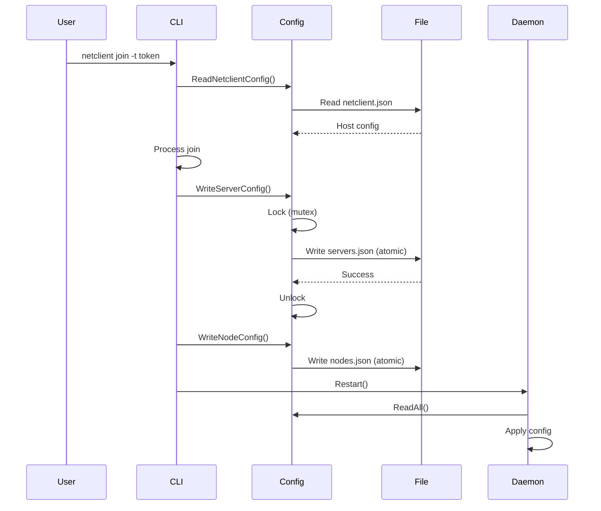
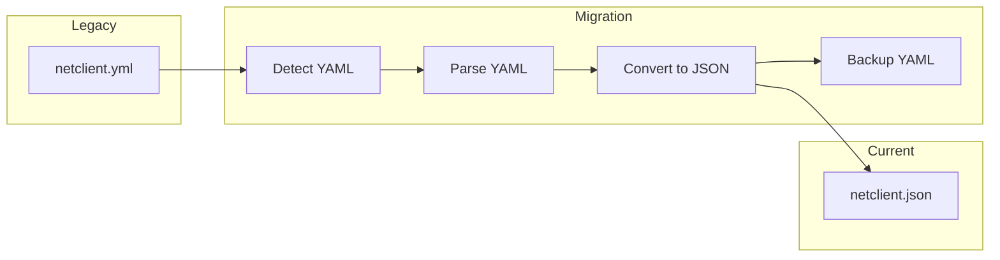

# Configuration

This document describes Netclient's configuration files, formats, and data management.

## Configuration Overview

```
┌─────────────────────────────────────────────────────────────────────────────────┐
│                         CONFIGURATION HIERARCHY                                  │
├─────────────────────────────────────────────────────────────────────────────────┤
│                                                                                  │
│   ┌─────────────────────────────────────────────────────────────────────────┐   │
│   │                           HOST LEVEL                                     │   │
│   │                                                                          │   │
│   │   netclient.json                                                         │   │
│   │   ├── Host identity (ID, name, MAC)                                      │   │
│   │   ├── WireGuard keys                                                     │   │
│   │   ├── Endpoints and interfaces                                           │   │
│   │   └── Global settings                                                    │   │
│   │                                                                          │   │
│   └─────────────────────────────────────────────────────────────────────────┘   │
│                                      │                                           │
│                                      ▼                                           │
│   ┌─────────────────────────────────────────────────────────────────────────┐   │
│   │                          SERVER LEVEL                                    │   │
│   │                                                                          │   │
│   │   servers.json                                                           │   │
│   │   ├── Server connections                                                 │   │
│   │   ├── MQTT broker details                                                │   │
│   │   ├── API endpoints                                                      │   │
│   │   └── Authentication credentials                                         │   │
│   │                                                                          │   │
│   └─────────────────────────────────────────────────────────────────────────┘   │
│                                      │                                           │
│                                      ▼                                           │
│   ┌─────────────────────────────────────────────────────────────────────────┐   │
│   │                         NETWORK LEVEL                                    │   │
│   │                                                                          │   │
│   │   nodes.json                                                             │   │
│   │   ├── Per-network node config                                            │   │
│   │   ├── IP addresses                                                       │   │
│   │   ├── Gateway settings                                                   │   │
│   │   └── Connection state                                                   │   │
│   │                                                                          │   │
│   └─────────────────────────────────────────────────────────────────────────┘   │
│                                                                                  │
│   ┌─────────────────────────────────────────────────────────────────────────┐   │
│   │                         AUXILIARY FILES                                  │   │
│   │                                                                          │   │
│   │   dns.json       - DNS configuration                                     │   │
│   │   .serverctx     - Current server context                                │   │
│   │   *.lock         - Lock files                                            │   │
│   │                                                                          │   │
│   └─────────────────────────────────────────────────────────────────────────┘   │
│                                                                                  │
└─────────────────────────────────────────────────────────────────────────────────┘
```

---

## File Locations

### Linux

```
/etc/netclient/
├── netclient.json      # Host configuration
├── nodes.json          # Network nodes
├── servers.json        # Server configurations
├── dns.json            # DNS settings
├── .serverctx          # Current server context
├── netclient.lock      # Daemon lock file
└── config.lock         # Config write lock
```

### macOS

```
/Applications/Netclient/
├── netclient.json
├── nodes.json
├── servers.json
├── dns.json
├── .serverctx
└── *.lock
```

### Windows

```
C:\Program Files (x86)\Netclient\
├── netclient.json
├── nodes.json
├── servers.json
├── dns.json
├── .serverctx
└── *.lock
```

---

## netclient.json - Host Configuration

The primary configuration file containing host identity and global settings.

### Schema

```json
{
  "id": "uuid",
  "name": "hostname",
  "os": "linux",
  "version": "v1.4.0",
  "publickey": "base64-encoded-wg-public-key",
  "macaddress": "aa:bb:cc:dd:ee:ff",
  "listenport": 51821,
  "mtu": 1420,
  "interfaces": [
    {
      "name": "eth0",
      "address": {
        "ip": "192.168.1.100",
        "network": "192.168.1.0/24"
      }
    }
  ],
  "defaultinterface": "eth0",
  "endpointip": "203.0.113.50",
  "endpointipv6": "2001:db8::1",
  "isdefault": true,
  "nat_type": "symmetric",
  "persistentkeepalive": 25,
  "autoupdate": true,
  "traffickeypublic": "base64-encoded-nacl-public-key"
}
```

### Field Descriptions

| Field | Type | Description |
|-------|------|-------------|
| `id` | UUID | Unique host identifier |
| `name` | string | Hostname (auto-detected or user-set) |
| `os` | string | Operating system (linux, darwin, windows, freebsd) |
| `version` | string | Netclient version |
| `publickey` | string | WireGuard public key (base64) |
| `macaddress` | string | Primary network interface MAC |
| `listenport` | int | WireGuard UDP listen port |
| `mtu` | int | Maximum transmission unit (default: 1420) |
| `interfaces` | array | Local network interfaces |
| `defaultinterface` | string | Default route interface name |
| `endpointip` | string | Discovered public IPv4 address |
| `endpointipv6` | string | Discovered public IPv6 address |
| `isdefault` | bool | Whether this is the default host |
| `nat_type` | string | Detected NAT type |
| `persistentkeepalive` | int | WireGuard keepalive interval (seconds) |
| `autoupdate` | bool | Enable automatic updates |
| `traffickeypublic` | string | NaCl Box public key for traffic encryption |

---

## servers.json - Server Configurations

Stores connection details for Netmaker servers.

### Schema

```json
{
  "my-server": {
    "name": "my-server",
    "api": "https://api.netmaker.example.com",
    "coredn": "broker.netmaker.example.com",
    "broker": "wss://broker.netmaker.example.com",
    "mqport": "443",
    "mqid": "uuid",
    "accesskey": "access-key-string",
    "password": "32-char-random-string",
    "is_ee": true,
    "networks": ["network1", "network2"],
    "dnsnameservers": [
      {
        "address": "10.10.10.1",
        "network": "network1"
      }
    ],
    "server_capabilities": {
      "flow_tracking": true,
      "metrics": true
    }
  }
}
```

### Field Descriptions

| Field | Type | Description |
|-------|------|-------------|
| `name` | string | Server display name |
| `api` | string | REST API endpoint URL |
| `coredn` | string | Core domain name |
| `broker` | string | MQTT broker WebSocket URL |
| `mqport` | string | MQTT port |
| `mqid` | UUID | MQTT client ID |
| `accesskey` | string | Server access key |
| `password` | string | Host password for this server |
| `is_ee` | bool | Enterprise edition features |
| `networks` | array | Joined networks on this server |
| `dnsnameservers` | array | DNS servers per network |
| `server_capabilities` | object | Server feature flags |

---

## nodes.json - Network Node Configurations

Per-network node configurations.

### Schema

```json
{
  "network1": {
    "id": "uuid",
    "hostid": "host-uuid",
    "network": "network1",
    "networkrange": "10.10.10.0/24",
    "networkrange6": "fd00::/64",
    "server": "my-server",
    "connected": true,
    "address": "10.10.10.5",
    "address6": "fd00::5",
    "postup": "",
    "postdown": "",
    "action": "",
    "islocal": false,
    "isingressgateway": false,
    "isegressgateway": false,
    "isrelay": false,
    "dnson": true,
    "isrelayed": false,
    "relayaddrs": [],
    "egressgatewayranges": [],
    "ingressgatewayrange": "",
    "persistentkeepalive": 25,
    "peers": [
      {
        "publickey": "base64-wg-public-key",
        "endpoint": "203.0.113.100:51821",
        "address": "10.10.10.6",
        "address6": "fd00::6",
        "allowedips": ["10.10.10.6/32", "fd00::6/128"],
        "isextclient": false,
        "isrelay": false,
        "isrelayed": false
      }
    ]
  }
}
```

### Field Descriptions

| Field | Type | Description |
|-------|------|-------------|
| `id` | UUID | Node identifier |
| `hostid` | UUID | Parent host ID |
| `network` | string | Network name |
| `networkrange` | string | IPv4 network CIDR |
| `networkrange6` | string | IPv6 network CIDR |
| `server` | string | Associated server name |
| `connected` | bool | Connection state |
| `address` | string | Assigned IPv4 address |
| `address6` | string | Assigned IPv6 address |
| `postup` | string | Post-up script |
| `postdown` | string | Post-down script |
| `action` | string | Pending action |
| `islocal` | bool | Local network mode |
| `isingressgateway` | bool | Ingress gateway role |
| `isegressgateway` | bool | Egress gateway role |
| `isrelay` | bool | Relay node role |
| `dnson` | bool | DNS enabled |
| `isrelayed` | bool | Traffic goes through relay |
| `relayaddrs` | array | Relay endpoint addresses |
| `egressgatewayranges` | array | Egress destination CIDRs |
| `ingressgatewayrange` | string | Ingress source CIDR |
| `persistentkeepalive` | int | Keepalive interval |
| `peers` | array | Peer configurations |

---

## dns.json - DNS Configuration

DNS resolution settings.

### Schema

```json
{
  "entries": {
    "node1.network1.netmaker": "10.10.10.5",
    "node2.network1.netmaker": "10.10.10.6"
  },
  "nameservers": ["10.10.10.1"],
  "search_domains": ["network1.netmaker"],
  "network": "network1"
}
```

---

## .serverctx - Server Context

Simple text file containing the current server context name.

```
my-server
```

---

## Configuration Data Flow



---

## Atomic File Writes

To prevent corruption, all config files are written atomically:

```
┌─────────────────────────────────────────────────────────────────────────────────┐
│                          ATOMIC WRITE PROCESS                                    │
├─────────────────────────────────────────────────────────────────────────────────┤
│                                                                                  │
│   1. WRITE TO TEMP FILE                                                          │
│   ┌─────────────────────────────────────────────────────────────────────────┐   │
│   │   f, _ := ioutil.TempFile(dir, "config-*.tmp")                          │   │
│   │   f.Write(jsonData)                                                      │   │
│   │   f.Sync()        // Flush to disk                                       │   │
│   │   f.Close()                                                              │   │
│   └─────────────────────────────────────────────────────────────────────────┘   │
│                                                                                  │
│   2. RENAME (ATOMIC ON POSIX)                                                    │
│   ┌─────────────────────────────────────────────────────────────────────────┐   │
│   │   os.Rename(tempFile, targetFile)                                        │   │
│   │   // Atomic operation - either completes fully or not at all            │   │
│   └─────────────────────────────────────────────────────────────────────────┘   │
│                                                                                  │
│   3. SYNC DIRECTORY                                                              │
│   ┌─────────────────────────────────────────────────────────────────────────┐   │
│   │   dir, _ := os.Open(dirPath)                                             │   │
│   │   dir.Sync()      // Ensure directory entry is persisted                 │   │
│   │   dir.Close()                                                            │   │
│   └─────────────────────────────────────────────────────────────────────────┘   │
│                                                                                  │
└─────────────────────────────────────────────────────────────────────────────────┘
```

---

## Thread Safety

All configuration operations are protected by RWMutex:

```go
var configMutex sync.RWMutex

func ReadConfig() Config {
    configMutex.RLock()
    defer configMutex.RUnlock()
    // Read operations
}

func WriteConfig(cfg Config) error {
    configMutex.Lock()
    defer configMutex.Unlock()
    // Write operations
}
```

### Deadlock Detection

```
┌─────────────────────────────────────────────────────────────────────────────────┐
│                          DEADLOCK DETECTION                                      │
├─────────────────────────────────────────────────────────────────────────────────┤
│                                                                                  │
│   Lock acquisition with timeout:                                                 │
│                                                                                  │
│   ┌─────────────────────────────────────────────────────────────────────────┐   │
│   │                                                                         │   │
│   │   timeout := time.After(30 * time.Second)                               │   │
│   │   acquired := make(chan struct{})                                       │   │
│   │                                                                         │   │
│   │   go func() {                                                           │   │
│   │       configMutex.Lock()                                                │   │
│   │       close(acquired)                                                   │   │
│   │   }()                                                                   │   │
│   │                                                                         │   │
│   │   select {                                                              │   │
│   │   case <-acquired:                                                      │   │
│   │       // Lock acquired                                                  │   │
│   │   case <-timeout:                                                       │   │
│   │       log.Error("Potential deadlock detected")                          │   │
│   │       // Stack trace dump                                               │   │
│   │   }                                                                     │   │
│   │                                                                         │   │
│   └─────────────────────────────────────────────────────────────────────────┘   │
│                                                                                  │
└─────────────────────────────────────────────────────────────────────────────────┘
```

---

## Configuration Migration

Legacy YAML configuration is automatically migrated to JSON:



**Migration Process:**

1. Check for `*.yml` files in config directory
2. Parse YAML content
3. Convert to corresponding JSON structure
4. Write new JSON files atomically
5. Rename YAML to `.yml.bak`

---

## Environment Variables

Netclient respects certain environment variables:

| Variable | Description | Default |
|----------|-------------|---------|
| `NETCLIENT_LOG_LEVEL` | Logging level (debug, info, warn, error) | info |
| `NETCLIENT_CONFIG_DIR` | Configuration directory | Platform-specific |
| `NETCLIENT_DATA_DIR` | Data directory | Platform-specific |

---

## Sensitive Data Handling

```
┌─────────────────────────────────────────────────────────────────────────────────┐
│                          SENSITIVE DATA                                          │
├─────────────────────────────────────────────────────────────────────────────────┤
│                                                                                  │
│   STORED ENCRYPTED/SECURELY:                                                     │
│   ┌─────────────────────────────────────────────────────────────────────────┐   │
│   │                                                                         │   │
│   │   • WireGuard private key (in netclient.json)                           │   │
│   │   • Traffic private key (NaCl Box)                                      │   │
│   │   • Host password (in servers.json)                                     │   │
│   │   • Access keys                                                         │   │
│   │                                                                         │   │
│   └─────────────────────────────────────────────────────────────────────────┘   │
│                                                                                  │
│   FILE PERMISSIONS:                                                              │
│   ┌─────────────────────────────────────────────────────────────────────────┐   │
│   │                                                                         │   │
│   │   Linux/macOS:                                                          │   │
│   │   • Config directory: 0700 (drwx------)                                 │   │
│   │   • Config files:     0600 (-rw-------)                                 │   │
│   │                                                                         │   │
│   │   Windows:                                                              │   │
│   │   • SYSTEM and Administrators only                                      │   │
│   │                                                                         │   │
│   └─────────────────────────────────────────────────────────────────────────┘   │
│                                                                                  │
│   NEVER LOGGED:                                                                  │
│   ┌─────────────────────────────────────────────────────────────────────────┐   │
│   │                                                                         │   │
│   │   • Private keys                                                        │   │
│   │   • Passwords                                                           │   │
│   │   • Access tokens                                                       │   │
│   │   • JWT tokens                                                          │   │
│   │                                                                         │   │
│   └─────────────────────────────────────────────────────────────────────────┘   │
│                                                                                  │
└─────────────────────────────────────────────────────────────────────────────────┘
```

---

## Related Documentation

- [Architecture](Architecture) - System architecture
- [Workflows](Workflows) - Process flows
- [System Integration](System-Integration) - OS integration
- [Components](Components) - Package breakdown
