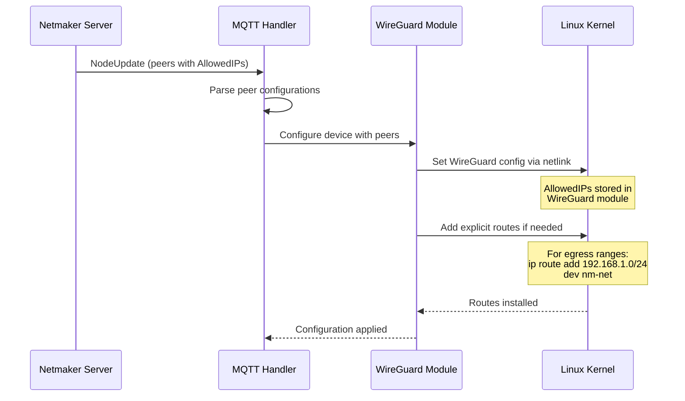
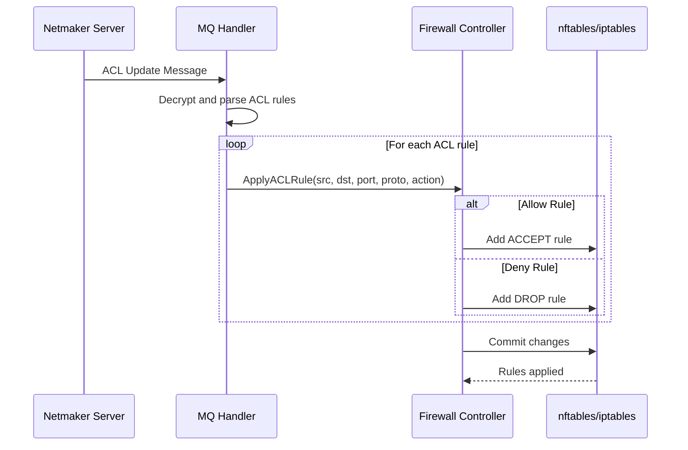

# Network Setup Deep Dive

This document provides an expert-level explanation of how Netmaker orchestrates WireGuard tunnels, routing tables, and firewall rules to create a secure mesh VPN network.

## Table of Contents

- [Overview](#overview)
- [WireGuard Tunnel Setup](#wireguard-tunnel-setup)
- [Routing Architecture](#routing-architecture)
- [Firewall Configuration](#firewall-configuration)
- [NAT and Masquerading](#nat-and-masquerading)
- [Complete Data Path](#complete-data-path)

---

## Overview

Netmaker creates a software-defined mesh network where each node runs a WireGuard interface. The architecture follows a **hub-and-spoke control plane** with a **peer-to-peer data plane**:

```
┌─────────────────────────────────────────────────────────────────────────────────┐
│                        NETMAKER ARCHITECTURE                                     │
├─────────────────────────────────────────────────────────────────────────────────┤
│                                                                                  │
│                           CONTROL PLANE                                          │
│   ┌─────────────────────────────────────────────────────────────────────────┐   │
│   │                                                                         │   │
│   │                      ┌─────────────────┐                                │   │
│   │                      │  NETMAKER       │                                │   │
│   │                      │  SERVER         │                                │   │
│   │                      │                 │                                │   │
│   │                      │  • REST API     │                                │   │
│   │                      │  • MQTT Broker  │                                │   │
│   │                      │  • Config Store │                                │   │
│   │                      └────────┬────────┘                                │   │
│   │                               │                                         │   │
│   │              ┌────────────────┼────────────────┐                        │   │
│   │              │                │                │                        │   │
│   │              ▼                ▼                ▼                        │   │
│   │        ┌──────────┐    ┌──────────┐    ┌──────────┐                    │   │
│   │        │Netclient │    │Netclient │    │Netclient │                    │   │
│   │        │  Node A  │    │  Node B  │    │  Node C  │                    │   │
│   │        └──────────┘    └──────────┘    └──────────┘                    │   │
│   │                                                                         │   │
│   └─────────────────────────────────────────────────────────────────────────┘   │
│                                                                                  │
│                            DATA PLANE                                            │
│   ┌─────────────────────────────────────────────────────────────────────────┐   │
│   │                                                                         │   │
│   │        ┌──────────┐    ┌──────────┐    ┌──────────┐                    │   │
│   │        │ Node A   │◄──►│ Node B   │◄──►│ Node C   │                    │   │
│   │        │          │    │          │    │          │                    │   │
│   │        │ WireGuard│    │ WireGuard│    │ WireGuard│                    │   │
│   │        │ (nm-net) │◄───┴────┬─────┴───►│ (nm-net) │                    │   │
│   │        └──────────┘         │          └──────────┘                    │   │
│   │                             │                                           │   │
│   │                    Encrypted UDP                                        │   │
│   │                    (Peer-to-Peer)                                       │   │
│   │                                                                         │   │
│   └─────────────────────────────────────────────────────────────────────────┘   │
│                                                                                  │
└─────────────────────────────────────────────────────────────────────────────────┘
```

**Key Principle:** The Netmaker server never sees VPN traffic. It only distributes configuration (public keys, endpoints, allowed IPs). All encrypted traffic flows directly between peers via WireGuard.

---

## WireGuard Tunnel Setup

### How WireGuard Works

WireGuard is a Layer 3 VPN that creates virtual network interfaces. Each interface has:

1. **Private Key** - Used for decryption and signing
2. **Public Key** - Shared with peers for encryption
3. **Listen Port** - UDP port for incoming packets
4. **Peers** - List of allowed remote endpoints

```
┌─────────────────────────────────────────────────────────────────────────────────┐
│                      WIREGUARD CRYPTOGRAPHIC MODEL                               │
├─────────────────────────────────────────────────────────────────────────────────┤
│                                                                                  │
│   NODE A                                           NODE B                        │
│   ┌─────────────────────────────┐   ┌─────────────────────────────┐             │
│   │                             │   │                             │             │
│   │  Private Key: priv_A        │   │  Private Key: priv_B        │             │
│   │  Public Key:  pub_A         │   │  Public Key:  pub_B         │             │
│   │                             │   │                             │             │
│   │  Peer Config:               │   │  Peer Config:               │             │
│   │  ┌─────────────────────┐   │   │  ┌─────────────────────┐   │             │
│   │  │ PublicKey: pub_B    │   │   │  │ PublicKey: pub_A    │   │             │
│   │  │ Endpoint: B:51821   │   │   │  │ Endpoint: A:51821   │   │             │
│   │  │ AllowedIPs: 10.0.0.2│   │   │  │ AllowedIPs: 10.0.0.1│   │             │
│   │  └─────────────────────┘   │   │  └─────────────────────┘   │             │
│   │                             │   │                             │             │
│   └─────────────────────────────┘   └─────────────────────────────┘             │
│                                                                                  │
│   HANDSHAKE (Noise Protocol IK):                                                 │
│   ┌─────────────────────────────────────────────────────────────────────────┐   │
│   │                                                                         │   │
│   │   A → B: Initiator Message                                              │   │
│   │          E_A (ephemeral pubkey)                                         │   │
│   │          AEAD(key, timestamp)                                           │   │
│   │                                                                         │   │
│   │   B → A: Responder Message                                              │   │
│   │          E_B (ephemeral pubkey)                                         │   │
│   │          AEAD(key, empty)                                               │   │
│   │                                                                         │   │
│   │   Result: Symmetric session keys derived via ECDH                       │   │
│   │                                                                         │   │
│   └─────────────────────────────────────────────────────────────────────────┘   │
│                                                                                  │
└─────────────────────────────────────────────────────────────────────────────────┘
```

### Netclient Interface Creation Sequence

When Netclient joins a network, it performs these steps:

```
┌─────────────────────────────────────────────────────────────────────────────────┐
│                    WIREGUARD INTERFACE SETUP SEQUENCE                            │
├─────────────────────────────────────────────────────────────────────────────────┤
│                                                                                  │
│   STEP 1: KEY GENERATION (if new host)                                           │
│   ┌─────────────────────────────────────────────────────────────────────────┐   │
│   │                                                                         │   │
│   │   privateKey, _ := wgtypes.GeneratePrivateKey()                         │   │
│   │   publicKey := privateKey.PublicKey()                                   │   │
│   │                                                                         │   │
│   │   // Keys are Curve25519 (32 bytes each)                                │   │
│   │   // Stored in netclient.json                                           │   │
│   │                                                                         │   │
│   └─────────────────────────────────────────────────────────────────────────┘   │
│                                                                                  │
│   STEP 2: INTERFACE CREATION                                                     │
│   ┌─────────────────────────────────────────────────────────────────────────┐   │
│   │                                                                         │   │
│   │   Linux (netlink):                                                      │   │
│   │   ┌─────────────────────────────────────────────────────────────────┐  │   │
│   │   │  la := netlink.NewLinkAttrs()                                   │  │   │
│   │   │  la.Name = "nm-mynetwork"                                       │  │   │
│   │   │  la.MTU = 1420                                                  │  │   │
│   │   │                                                                  │  │   │
│   │   │  link := &netlink.Wireguard{LinkAttrs: la}                      │  │   │
│   │   │  netlink.LinkAdd(link)                                          │  │   │
│   │   └─────────────────────────────────────────────────────────────────┘  │   │
│   │                                                                         │   │
│   │   // Creates: nm-mynetwork interface                                    │   │
│   │   // Type: wireguard                                                    │   │
│   │   // State: DOWN (not yet configured)                                   │   │
│   │                                                                         │   │
│   └─────────────────────────────────────────────────────────────────────────┘   │
│                                                                                  │
│   STEP 3: IP ADDRESS ASSIGNMENT                                                  │
│   ┌─────────────────────────────────────────────────────────────────────────┐   │
│   │                                                                         │   │
│   │   // Assigned by Netmaker server from network CIDR                      │   │
│   │   addr, _ := netlink.ParseAddr("10.10.10.5/24")                         │   │
│   │   netlink.AddrAdd(link, addr)                                           │   │
│   │                                                                         │   │
│   │   // IPv6 (if enabled)                                                  │   │
│   │   addr6, _ := netlink.ParseAddr("fd00::5/64")                           │   │
│   │   netlink.AddrAdd(link, addr6)                                          │   │
│   │                                                                         │   │
│   └─────────────────────────────────────────────────────────────────────────┘   │
│                                                                                  │
│   STEP 4: WIREGUARD CONFIGURATION                                                │
│   ┌─────────────────────────────────────────────────────────────────────────┐   │
│   │                                                                         │   │
│   │   client, _ := wgctrl.New()                                             │   │
│   │                                                                         │   │
│   │   config := wgtypes.Config{                                             │   │
│   │       PrivateKey:   &privateKey,                                        │   │
│   │       ListenPort:   &listenPort,    // 51821                            │   │
│   │       ReplacePeers: true,                                               │   │
│   │       Peers:        peerConfigs,    // From server                      │   │
│   │   }                                                                     │   │
│   │                                                                         │   │
│   │   client.ConfigureDevice("nm-mynetwork", config)                        │   │
│   │                                                                         │   │
│   └─────────────────────────────────────────────────────────────────────────┘   │
│                                                                                  │
│   STEP 5: BRING INTERFACE UP                                                     │
│   ┌─────────────────────────────────────────────────────────────────────────┐   │
│   │                                                                         │   │
│   │   netlink.LinkSetUp(link)                                               │   │
│   │                                                                         │   │
│   │   // Interface is now active and listening                              │   │
│   │                                                                         │   │
│   └─────────────────────────────────────────────────────────────────────────┘   │
│                                                                                  │
└─────────────────────────────────────────────────────────────────────────────────┘
```

### Peer Configuration

Each peer received from Netmaker server is configured with:

```go
type PeerConfig struct {
    PublicKey                   wgtypes.Key      // Peer's WG public key
    Endpoint                    *net.UDPAddr     // IP:port for outbound
    PersistentKeepaliveInterval time.Duration    // 25 seconds
    AllowedIPs                  []net.IPNet      // What IPs route to this peer
    PresharedKey                *wgtypes.Key     // Optional PSK for extra security
}
```

**AllowedIPs** is the crucial routing mechanism - it tells WireGuard:
- Which destination IPs should be encrypted and sent to this peer
- Which source IPs are valid for packets received from this peer

```
┌─────────────────────────────────────────────────────────────────────────────────┐
│                        ALLOWEDIPS ROUTING LOGIC                                  │
├─────────────────────────────────────────────────────────────────────────────────┤
│                                                                                  │
│   OUTBOUND (Local → Peer):                                                       │
│   ┌─────────────────────────────────────────────────────────────────────────┐   │
│   │                                                                         │   │
│   │   Application sends packet to 10.10.10.6                                │   │
│   │                       │                                                  │   │
│   │                       ▼                                                  │   │
│   │   Kernel routing table: 10.10.10.0/24 dev nm-mynetwork                  │   │
│   │                       │                                                  │   │
│   │                       ▼                                                  │   │
│   │   WireGuard checks AllowedIPs for each peer                             │   │
│   │   Peer B: AllowedIPs = [10.10.10.6/32]  ← MATCH!                        │   │
│   │                       │                                                  │   │
│   │                       ▼                                                  │   │
│   │   Encrypt with Peer B's session key                                     │   │
│   │   Send UDP to Peer B's endpoint                                         │   │
│   │                                                                         │   │
│   └─────────────────────────────────────────────────────────────────────────┘   │
│                                                                                  │
│   INBOUND (Peer → Local):                                                        │
│   ┌─────────────────────────────────────────────────────────────────────────┐   │
│   │                                                                         │   │
│   │   UDP packet received from Peer B's endpoint                            │   │
│   │                       │                                                  │   │
│   │                       ▼                                                  │   │
│   │   Decrypt with Peer B's session key                                     │   │
│   │                       │                                                  │   │
│   │                       ▼                                                  │   │
│   │   Check: Is source IP in Peer B's AllowedIPs?                           │   │
│   │   10.10.10.6 in [10.10.10.6/32]?  ← YES, accept                         │   │
│   │                       │                                                  │   │
│   │                       ▼                                                  │   │
│   │   Deliver to local network stack                                        │   │
│   │                                                                         │   │
│   └─────────────────────────────────────────────────────────────────────────┘   │
│                                                                                  │
└─────────────────────────────────────────────────────────────────────────────────┘
```

---

## Routing Architecture

### Route Types in Netclient

Netclient manages several types of routes:

```
┌─────────────────────────────────────────────────────────────────────────────────┐
│                           ROUTING TABLE MANAGEMENT                               │
├─────────────────────────────────────────────────────────────────────────────────┤
│                                                                                  │
│   TYPE 1: INTERFACE ROUTE (Automatic)                                            │
│   ┌─────────────────────────────────────────────────────────────────────────┐   │
│   │                                                                         │   │
│   │   When IP address is assigned to interface, kernel creates:             │   │
│   │                                                                         │   │
│   │   10.10.10.0/24 dev nm-mynetwork proto kernel scope link src 10.10.10.5 │   │
│   │                                                                         │   │
│   │   This routes the entire network CIDR to the WireGuard interface        │   │
│   │                                                                         │   │
│   └─────────────────────────────────────────────────────────────────────────┘   │
│                                                                                  │
│   TYPE 2: PEER HOST ROUTES (From AllowedIPs)                                     │
│   ┌─────────────────────────────────────────────────────────────────────────┐   │
│   │                                                                         │   │
│   │   WireGuard internally routes based on AllowedIPs:                      │   │
│   │                                                                         │   │
│   │   Peer A (10.10.10.2/32):                                               │   │
│   │     10.10.10.2 → encrypt → send to peer A endpoint                      │   │
│   │                                                                         │   │
│   │   Peer B (10.10.10.3/32):                                               │   │
│   │     10.10.10.3 → encrypt → send to peer B endpoint                      │   │
│   │                                                                         │   │
│   └─────────────────────────────────────────────────────────────────────────┘   │
│                                                                                  │
│   TYPE 3: EGRESS ROUTES (For Egress Gateways)                                    │
│   ┌─────────────────────────────────────────────────────────────────────────┐   │
│   │                                                                         │   │
│   │   Egress gateway provides access to external networks.                  │   │
│   │   Routes added to peer's AllowedIPs:                                    │   │
│   │                                                                         │   │
│   │   Egress Gateway Peer:                                                  │   │
│   │     AllowedIPs: [10.10.10.1/32, 192.168.1.0/24, 172.16.0.0/16]         │   │
│   │                                                                         │   │
│   │   Traffic to 192.168.1.x or 172.16.x.x routes through egress gateway   │   │
│   │                                                                         │   │
│   └─────────────────────────────────────────────────────────────────────────┘   │
│                                                                                  │
│   TYPE 4: DEFAULT ROUTE (Internet Gateway Mode)                                  │
│   ┌─────────────────────────────────────────────────────────────────────────┐   │
│   │                                                                         │   │
│   │   When using internet gateway feature:                                  │   │
│   │                                                                         │   │
│   │   AllowedIPs: [0.0.0.0/0, ::/0]                                         │   │
│   │                                                                         │   │
│   │   ALL traffic routes through the gateway node                           │   │
│   │   (Except traffic to the gateway's real endpoint)                       │   │
│   │                                                                         │   │
│   └─────────────────────────────────────────────────────────────────────────┘   │
│                                                                                  │
└─────────────────────────────────────────────────────────────────────────────────┘
```

### Route Installation Process



### Routing Decision Flow

```
┌─────────────────────────────────────────────────────────────────────────────────┐
│                         PACKET ROUTING DECISION                                  │
├─────────────────────────────────────────────────────────────────────────────────┤
│                                                                                  │
│   Application sends packet to destination IP                                     │
│                            │                                                     │
│                            ▼                                                     │
│   ┌────────────────────────────────────────────────────────────────────────┐    │
│   │                  KERNEL ROUTING TABLE LOOKUP                            │    │
│   │                                                                         │    │
│   │   ip route get <dest_ip>                                                │    │
│   │                                                                         │    │
│   │   Routing table (simplified):                                           │    │
│   │   ┌─────────────────────────────────────────────────────────────────┐  │    │
│   │   │ default via 192.168.1.1 dev eth0                                │  │    │
│   │   │ 10.10.10.0/24 dev nm-mynetwork                                  │  │    │
│   │   │ 192.168.1.0/24 dev eth0                                         │  │    │
│   │   │ 172.16.0.0/16 dev nm-mynetwork  (egress route)                  │  │    │
│   │   └─────────────────────────────────────────────────────────────────┘  │    │
│   │                                                                         │    │
│   └────────────────────────────────────────────────────────────────────────┘    │
│                            │                                                     │
│            ┌───────────────┴───────────────┐                                    │
│            │                               │                                    │
│     Match nm-mynetwork              Match eth0                                  │
│            │                               │                                    │
│            ▼                               ▼                                    │
│   ┌─────────────────┐             ┌─────────────────┐                           │
│   │   WireGuard     │             │   Normal        │                           │
│   │   Processing    │             │   Routing       │                           │
│   └────────┬────────┘             └─────────────────┘                           │
│            │                                                                     │
│            ▼                                                                     │
│   ┌────────────────────────────────────────────────────────────────────────┐    │
│   │                  WIREGUARD PEER SELECTION                               │    │
│   │                                                                         │    │
│   │   For dest 10.10.10.6:                                                  │    │
│   │   ┌─────────────────────────────────────────────────────────────────┐  │    │
│   │   │ Peer A: AllowedIPs [10.10.10.2/32]         → NO MATCH           │  │    │
│   │   │ Peer B: AllowedIPs [10.10.10.6/32]         → MATCH! Use Peer B  │  │    │
│   │   │ Peer C: AllowedIPs [10.10.10.3/32]         → NO MATCH           │  │    │
│   │   └─────────────────────────────────────────────────────────────────┘  │    │
│   │                                                                         │    │
│   │   Longest prefix match wins for overlapping ranges                      │    │
│   │                                                                         │    │
│   └────────────────────────────────────────────────────────────────────────┘    │
│                            │                                                     │
│                            ▼                                                     │
│   ┌────────────────────────────────────────────────────────────────────────┐    │
│   │   Encrypt packet with Peer B's session key                              │    │
│   │   Wrap in UDP: src_port=51821, dst=Peer_B_endpoint:51821               │    │
│   │   Send via physical interface (eth0)                                    │    │
│   └────────────────────────────────────────────────────────────────────────┘    │
│                                                                                  │
└─────────────────────────────────────────────────────────────────────────────────┘
```

---

## Firewall Configuration

### Firewall Architecture

Netclient configures firewall rules for three primary purposes:

1. **Access Control (ACLs)** - Control which peers can communicate
2. **NAT/Masquerading** - Enable egress gateway functionality
3. **Forwarding** - Allow packet forwarding through gateway nodes

```
┌─────────────────────────────────────────────────────────────────────────────────┐
│                        FIREWALL RULE ARCHITECTURE                                │
├─────────────────────────────────────────────────────────────────────────────────┤
│                                                                                  │
│                              PACKET FLOW                                         │
│                                                                                  │
│   INCOMING                                                                       │
│   ┌─────────────────────────────────────────────────────────────────────────┐   │
│   │                                                                         │   │
│   │   Network Interface                                                     │   │
│   │          │                                                              │   │
│   │          ▼                                                              │   │
│   │   ┌─────────────┐                                                       │   │
│   │   │ PREROUTING  │  (nat table - DNAT for ingress gateway)               │   │
│   │   └──────┬──────┘                                                       │   │
│   │          │                                                              │   │
│   │          ▼                                                              │   │
│   │   ┌─────────────────────────────────────────────────────────────────┐  │   │
│   │   │                    ROUTING DECISION                              │  │   │
│   │   │           Is packet for this host or forwarded?                  │  │   │
│   │   └─────────────────────────┬───────────────────────────────────────┘  │   │
│   │                             │                                           │   │
│   │            ┌────────────────┴────────────────┐                         │   │
│   │            │                                 │                         │   │
│   │       Local Delivery                    Forwarding                     │   │
│   │            │                                 │                         │   │
│   │            ▼                                 ▼                         │   │
│   │   ┌─────────────┐                   ┌─────────────┐                    │   │
│   │   │   INPUT     │                   │  FORWARD    │                    │   │
│   │   │   (ACLs)    │                   │ (Gateways)  │                    │   │
│   │   └──────┬──────┘                   └──────┬──────┘                    │   │
│   │          │                                 │                           │   │
│   │          ▼                                 │                           │   │
│   │   Local Process                            │                           │   │
│   │                                            │                           │   │
│   └────────────────────────────────────────────┼───────────────────────────┘   │
│                                                │                                │
│   OUTGOING                                     │                                │
│   ┌────────────────────────────────────────────┼───────────────────────────┐   │
│   │                                            │                           │   │
│   │   Local Process                            │                           │   │
│   │          │                                 │                           │   │
│   │          ▼                                 │                           │   │
│   │   ┌─────────────┐                          │                           │   │
│   │   │   OUTPUT    │                          │                           │   │
│   │   │   (ACLs)    │                          │                           │   │
│   │   └──────┬──────┘                          │                           │   │
│   │          │                                 │                           │   │
│   │          └────────────────┬────────────────┘                           │   │
│   │                           │                                            │   │
│   │                           ▼                                            │   │
│   │                   ┌─────────────┐                                      │   │
│   │                   │ POSTROUTING │  (nat table - SNAT/Masquerade)       │   │
│   │                   └──────┬──────┘                                      │   │
│   │                          │                                             │   │
│   │                          ▼                                             │   │
│   │                   Network Interface                                    │   │
│   │                                                                        │   │
│   └────────────────────────────────────────────────────────────────────────┘   │
│                                                                                  │
└─────────────────────────────────────────────────────────────────────────────────┘
```

### nftables Implementation

Netclient creates these nftables structures:

```
┌─────────────────────────────────────────────────────────────────────────────────┐
│                          NFTABLES STRUCTURE                                      │
├─────────────────────────────────────────────────────────────────────────────────┤
│                                                                                  │
│   # View with: nft list ruleset                                                  │
│                                                                                  │
│   table inet netmaker {                                                          │
│                                                                                  │
│       # Sets for efficient IP matching                                           │
│       set nm-mynetwork-peers {                                                   │
│           type ipv4_addr                                                         │
│           elements = { 10.10.10.2, 10.10.10.3, 10.10.10.4 }                      │
│       }                                                                          │
│                                                                                  │
│       set nm-mynetwork-egress {                                                  │
│           type ipv4_addr                                                         │
│           flags interval                                                         │
│           elements = { 192.168.1.0/24, 172.16.0.0/16 }                          │
│       }                                                                          │
│                                                                                  │
│       # INPUT chain - filter incoming traffic                                    │
│       chain NETMAKER-INPUT {                                                     │
│           type filter hook input priority 0; policy accept;                      │
│                                                                                  │
│           # Allow established connections                                        │
│           ct state established,related accept                                    │
│                                                                                  │
│           # Allow from VPN peers                                                 │
│           iifname "nm-*" ip saddr @nm-mynetwork-peers accept                    │
│                                                                                  │
│           # ACL rules (generated from server)                                    │
│           iifname "nm-mynetwork" ip saddr 10.10.10.3 ip daddr 10.10.10.5 drop   │
│       }                                                                          │
│                                                                                  │
│       # FORWARD chain - for gateway nodes                                        │
│       chain NETMAKER-FORWARD {                                                   │
│           type filter hook forward priority 0; policy accept;                    │
│                                                                                  │
│           # Allow related traffic                                                │
│           ct state established,related accept                                    │
│                                                                                  │
│           # Egress: VPN → External network                                       │
│           iifname "nm-mynetwork" oifname "eth0" \                               │
│               ip saddr @nm-mynetwork-peers \                                     │
│               ip daddr @nm-mynetwork-egress accept                              │
│                                                                                  │
│           # Ingress: External → VPN                                              │
│           iifname "eth0" oifname "nm-mynetwork" \                               │
│               ip daddr @nm-mynetwork-peers accept                               │
│       }                                                                          │
│                                                                                  │
│       # NAT for egress gateway                                                   │
│       chain NETMAKER-POSTROUTING {                                               │
│           type nat hook postrouting priority 100;                                │
│                                                                                  │
│           # Masquerade VPN traffic going to external networks                    │
│           iifname "nm-mynetwork" oifname "eth0" \                               │
│               ip saddr @nm-mynetwork-peers masquerade                           │
│       }                                                                          │
│   }                                                                              │
│                                                                                  │
└─────────────────────────────────────────────────────────────────────────────────┘
```

### iptables Implementation (Legacy)

```bash
# Chains
iptables -N NETMAKER-INPUT
iptables -N NETMAKER-FORWARD
iptables -N NETMAKER-POSTROUTING -t nat

# Hook into main chains
iptables -I INPUT -j NETMAKER-INPUT
iptables -I FORWARD -j NETMAKER-FORWARD
iptables -I POSTROUTING -t nat -j NETMAKER-POSTROUTING

# INPUT rules
iptables -A NETMAKER-INPUT -m state --state ESTABLISHED,RELATED -j ACCEPT
iptables -A NETMAKER-INPUT -i nm-mynetwork -s 10.10.10.0/24 -j ACCEPT

# FORWARD rules (egress gateway)
iptables -A NETMAKER-FORWARD -i nm-mynetwork -o eth0 -s 10.10.10.0/24 -d 192.168.1.0/24 -j ACCEPT
iptables -A NETMAKER-FORWARD -i eth0 -o nm-mynetwork -m state --state ESTABLISHED,RELATED -j ACCEPT

# NAT rules (masquerade)
iptables -t nat -A NETMAKER-POSTROUTING -s 10.10.10.0/24 -o eth0 -j MASQUERADE
```

### ACL Rule Processing



---

## NAT and Masquerading

### Egress Gateway NAT

When a node is configured as an egress gateway, it performs SNAT (Source NAT) to allow VPN clients to access external networks:

```
┌─────────────────────────────────────────────────────────────────────────────────┐
│                          EGRESS GATEWAY NAT FLOW                                 │
├─────────────────────────────────────────────────────────────────────────────────┤
│                                                                                  │
│   VPN Client                Egress Gateway                External Server        │
│   10.10.10.5               10.10.10.1 / 192.168.1.100    192.168.1.50           │
│                                                                                  │
│   ┌──────────┐             ┌──────────────────┐          ┌──────────┐           │
│   │          │             │                  │          │          │           │
│   │  Client  │             │  Gateway Node    │          │  Server  │           │
│   │          │             │                  │          │          │           │
│   └────┬─────┘             └────────┬─────────┘          └────┬─────┘           │
│        │                            │                         │                 │
│        │  1. Original Packet        │                         │                 │
│        │  ┌─────────────────────┐   │                         │                 │
│        │  │ Src: 10.10.10.5     │   │                         │                 │
│        │  │ Dst: 192.168.1.50   │   │                         │                 │
│        │  └─────────────────────┘   │                         │                 │
│        │                            │                         │                 │
│        │──────── WireGuard ────────►│                         │                 │
│        │        (encrypted)         │                         │                 │
│        │                            │                         │                 │
│        │                            │  2. After NAT           │                 │
│        │                            │  ┌─────────────────────┐│                 │
│        │                            │  │ Src: 192.168.1.100  ││                 │
│        │                            │  │ Dst: 192.168.1.50   ││                 │
│        │                            │  └─────────────────────┘│                 │
│        │                            │                         │                 │
│        │                            │─────── Regular ────────►│                 │
│        │                            │        Ethernet         │                 │
│        │                            │                         │                 │
│        │                            │  3. Response            │                 │
│        │                            │  ┌─────────────────────┐│                 │
│        │                            │  │ Src: 192.168.1.50   ││                 │
│        │                            │  │ Dst: 192.168.1.100  ││                 │
│        │                            │◄─┴─────────────────────┴│                 │
│        │                            │                         │                 │
│        │                            │  4. Reverse NAT         │                 │
│        │                            │  ┌─────────────────────┐│                 │
│        │  5. Response to Client     │  │ Src: 192.168.1.50   ││                 │
│        │  ┌─────────────────────┐   │  │ Dst: 10.10.10.5     ││                 │
│        │  │ Src: 192.168.1.50   │   │  └─────────────────────┘│                 │
│        │  │ Dst: 10.10.10.5     │   │                         │                 │
│        │◄─┴─────────────────────┴───│                         │                 │
│        │        WireGuard           │                         │                 │
│        │       (encrypted)          │                         │                 │
│                                                                                  │
└─────────────────────────────────────────────────────────────────────────────────┘
```

### IP Masquerading Rule

```bash
# nftables
nft add rule inet netmaker NETMAKER-POSTROUTING \
    iifname "nm-mynetwork" oifname "eth0" masquerade

# iptables equivalent
iptables -t nat -A NETMAKER-POSTROUTING \
    -s 10.10.10.0/24 -o eth0 -j MASQUERADE
```

### Connection Tracking

The kernel's conntrack module tracks NAT'd connections:

```
# View active connections
conntrack -L

# Example entry:
tcp  6 118 TIME_WAIT src=10.10.10.5 dst=192.168.1.50 sport=45678 dport=80 \
     src=192.168.1.50 dst=192.168.1.100 sport=80 dport=45678 [ASSURED]
```

---

## Complete Data Path

### End-to-End Packet Flow

```
┌─────────────────────────────────────────────────────────────────────────────────┐
│                      COMPLETE DATA PATH: NODE A → NODE B                         │
├─────────────────────────────────────────────────────────────────────────────────┤
│                                                                                  │
│   NODE A (10.10.10.5)                              NODE B (10.10.10.6)           │
│   Public IP: 203.0.113.10                          Public IP: 198.51.100.20     │
│                                                                                  │
│   ┌─────────────────────────────────────────────────────────────────────────┐   │
│   │                                                                         │   │
│   │   1. APPLICATION LAYER                                                  │   │
│   │   ┌─────────────────────────────────────────────────────────────────┐  │   │
│   │   │  ping 10.10.10.6                                                │  │   │
│   │   │  App creates: ICMP Echo Request, dst=10.10.10.6                 │  │   │
│   │   └─────────────────────────────────────────────────────────────────┘  │   │
│   │                              │                                          │   │
│   │                              ▼                                          │   │
│   │   2. KERNEL ROUTING                                                     │   │
│   │   ┌─────────────────────────────────────────────────────────────────┐  │   │
│   │   │  ip route get 10.10.10.6                                        │  │   │
│   │   │  → 10.10.10.6 dev nm-mynetwork src 10.10.10.5                   │  │   │
│   │   └─────────────────────────────────────────────────────────────────┘  │   │
│   │                              │                                          │   │
│   │                              ▼                                          │   │
│   │   3. NETFILTER (OUTPUT chain)                                           │   │
│   │   ┌─────────────────────────────────────────────────────────────────┐  │   │
│   │   │  NETMAKER-OUTPUT: Check ACLs                                    │  │   │
│   │   │  → ACCEPT (10.10.10.5 → 10.10.10.6 allowed)                     │  │   │
│   │   └─────────────────────────────────────────────────────────────────┘  │   │
│   │                              │                                          │   │
│   │                              ▼                                          │   │
│   │   4. WIREGUARD ENCRYPTION                                               │   │
│   │   ┌─────────────────────────────────────────────────────────────────┐  │   │
│   │   │  Interface: nm-mynetwork                                        │  │   │
│   │   │  Lookup peer for 10.10.10.6 → Peer B                            │  │   │
│   │   │  Peer B endpoint: 198.51.100.20:51821                           │  │   │
│   │   │                                                                  │  │   │
│   │   │  Encrypt payload with ChaCha20-Poly1305                         │  │   │
│   │   │  Add WireGuard header                                           │  │   │
│   │   └─────────────────────────────────────────────────────────────────┘  │   │
│   │                              │                                          │   │
│   │                              ▼                                          │   │
│   │   5. UDP ENCAPSULATION                                                  │   │
│   │   ┌─────────────────────────────────────────────────────────────────┐  │   │
│   │   │  UDP Header:                                                    │  │   │
│   │   │    Src Port: 51821                                              │  │   │
│   │   │    Dst Port: 51821                                              │  │   │
│   │   │                                                                  │  │   │
│   │   │  IP Header:                                                     │  │   │
│   │   │    Src: 203.0.113.10                                            │  │   │
│   │   │    Dst: 198.51.100.20                                           │  │   │
│   │   └─────────────────────────────────────────────────────────────────┘  │   │
│   │                              │                                          │   │
│   │                              ▼                                          │   │
│   │   6. PHYSICAL TRANSMISSION                                              │   │
│   │   ┌─────────────────────────────────────────────────────────────────┐  │   │
│   │   │  eth0 → Router → Internet → Router → eth0                       │  │   │
│   │   └─────────────────────────────────────────────────────────────────┘  │   │
│   │                              │                                          │   │
│   │                              ▼                                          │   │
│   │   7. NODE B: UDP RECEPTION                                              │   │
│   │   ┌─────────────────────────────────────────────────────────────────┐  │   │
│   │   │  UDP port 51821 → WireGuard kernel module                       │  │   │
│   │   └─────────────────────────────────────────────────────────────────┘  │   │
│   │                              │                                          │   │
│   │                              ▼                                          │   │
│   │   8. WIREGUARD DECRYPTION                                               │   │
│   │   ┌─────────────────────────────────────────────────────────────────┐  │   │
│   │   │  Identify peer by source IP (203.0.113.10)                      │  │   │
│   │   │  Decrypt with session key                                       │  │   │
│   │   │  Verify: inner src (10.10.10.5) in AllowedIPs for Peer A        │  │   │
│   │   └─────────────────────────────────────────────────────────────────┘  │   │
│   │                              │                                          │   │
│   │                              ▼                                          │   │
│   │   9. NETFILTER (INPUT chain)                                            │   │
│   │   ┌─────────────────────────────────────────────────────────────────┐  │   │
│   │   │  NETMAKER-INPUT: Check ACLs                                     │  │   │
│   │   │  → ACCEPT (10.10.10.5 allowed to reach 10.10.10.6)              │  │   │
│   │   └─────────────────────────────────────────────────────────────────┘  │   │
│   │                              │                                          │   │
│   │                              ▼                                          │   │
│   │   10. LOCAL DELIVERY                                                    │   │
│   │   ┌─────────────────────────────────────────────────────────────────┐  │   │
│   │   │  ICMP Echo Request delivered to kernel                          │  │   │
│   │   │  Kernel generates ICMP Echo Reply                               │  │   │
│   │   │  (Reverse path follows same steps)                              │  │   │
│   │   └─────────────────────────────────────────────────────────────────┘  │   │
│   │                                                                         │   │
│   └─────────────────────────────────────────────────────────────────────────┘   │
│                                                                                  │
└─────────────────────────────────────────────────────────────────────────────────┘
```

### Packet Structure

```
┌─────────────────────────────────────────────────────────────────────────────────┐
│                           PACKET ENCAPSULATION                                   │
├─────────────────────────────────────────────────────────────────────────────────┤
│                                                                                  │
│   ORIGINAL PACKET (before WireGuard)                                             │
│   ┌─────────────────────────────────────────────────────────────────────────┐   │
│   │  IP Header          │  ICMP Header      │  ICMP Payload               │   │
│   │  Src: 10.10.10.5    │  Type: 8 (Echo)   │  "Hello"                    │   │
│   │  Dst: 10.10.10.6    │  Code: 0          │                              │   │
│   │  Proto: ICMP        │                    │                              │   │
│   └─────────────────────────────────────────────────────────────────────────┘   │
│                                                                                  │
│   AFTER WIREGUARD ENCRYPTION                                                     │
│   ┌─────────────────────────────────────────────────────────────────────────┐   │
│   │  Outer IP   │  UDP     │  WG Header  │  Encrypted Payload            │   │
│   │  Header     │  Header  │             │  (Original packet)             │   │
│   │             │          │             │                                │   │
│   │  Src:       │  Src:    │  Type: 4    │  ┌──────────────────────────┐ │   │
│   │  203.0.113  │  51821   │  (Data)     │  │ ChaCha20-Poly1305        │ │   │
│   │  .10        │          │             │  │ encrypted content        │ │   │
│   │             │  Dst:    │  Receiver   │  │                          │ │   │
│   │  Dst:       │  51821   │  Index: 123 │  │ + 16-byte auth tag       │ │   │
│   │  198.51.100 │          │             │  └──────────────────────────┘ │   │
│   │  .20        │          │  Counter:   │                                │   │
│   │             │          │  45678      │                                │   │
│   │  Proto: UDP │          │             │                                │   │
│   └─────────────────────────────────────────────────────────────────────────┘   │
│                                                                                  │
│   Size comparison:                                                               │
│   Original:  28 bytes (IP) + 8 bytes (ICMP) + payload = ~36+ bytes              │
│   Encrypted: 20 bytes (outer IP) + 8 bytes (UDP) + 16 bytes (WG header)         │
│              + original packet + 16 bytes (auth tag) = ~96+ bytes               │
│                                                                                  │
│   Overhead: ~60 bytes per packet (hence MTU 1420 instead of 1500)               │
│                                                                                  │
└─────────────────────────────────────────────────────────────────────────────────┘
```

---

## Diagnostic Commands

### View WireGuard Status

```bash
# Show interface and peer status
wg show nm-mynetwork

# Output:
interface: nm-mynetwork
  public key: <base64>
  private key: (hidden)
  listening port: 51821

peer: <peer_public_key>
  endpoint: 198.51.100.20:51821
  allowed ips: 10.10.10.6/32
  latest handshake: 45 seconds ago
  transfer: 1.5 MiB received, 2.3 MiB sent
  persistent keepalive: every 25 seconds
```

### View Routes

```bash
# Show routes through WireGuard interface
ip route show dev nm-mynetwork

# Output:
10.10.10.0/24 proto kernel scope link src 10.10.10.5
192.168.1.0/24 via 10.10.10.1  # Egress route
```

### View Firewall Rules

```bash
# nftables
nft list table inet netmaker

# iptables
iptables -L NETMAKER-INPUT -v -n
iptables -L NETMAKER-FORWARD -v -n
iptables -t nat -L NETMAKER-POSTROUTING -v -n
```

### View NAT Connections

```bash
# Active NAT sessions
conntrack -L -n
```

---

## Related Documentation

- [Architecture](Architecture) - System architecture overview
- [Workflows](Workflows) - Process flow diagrams
- [System Integration](System-Integration) - OS integration details
- [Components](Components) - Package breakdown
