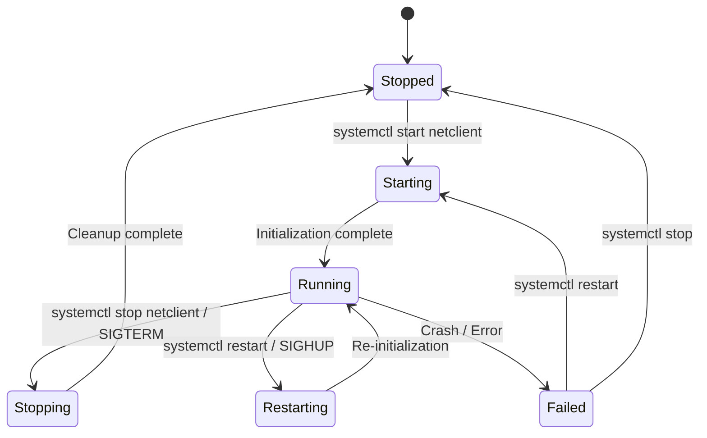
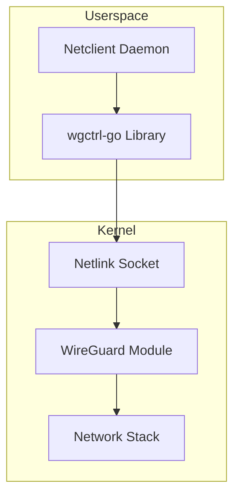
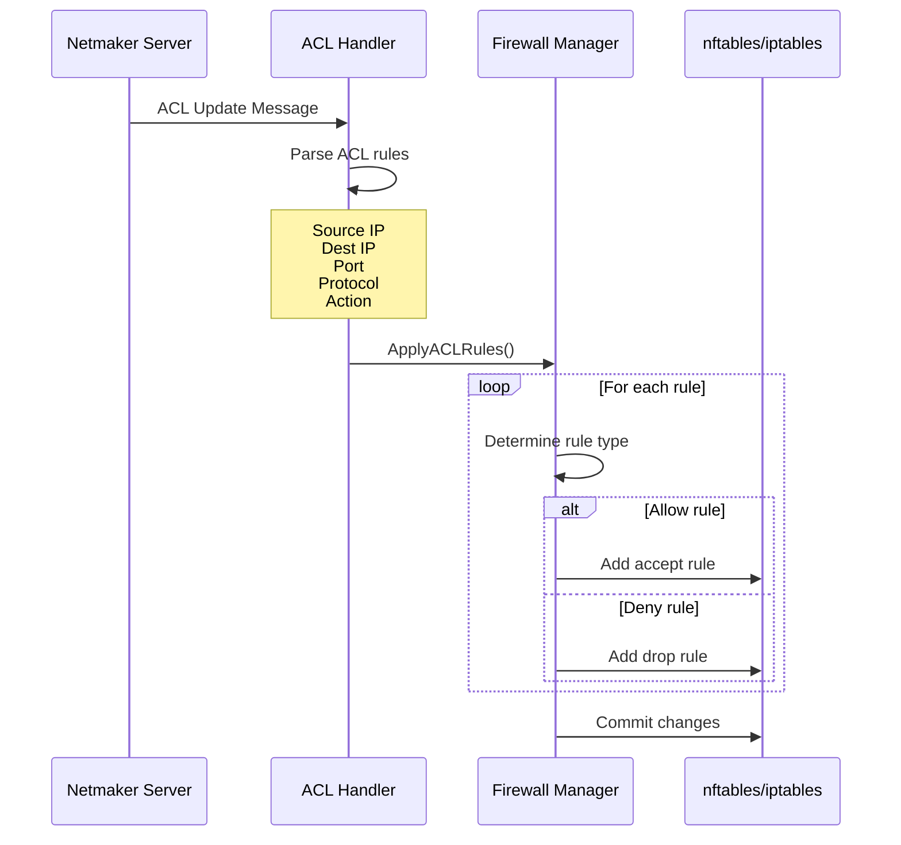
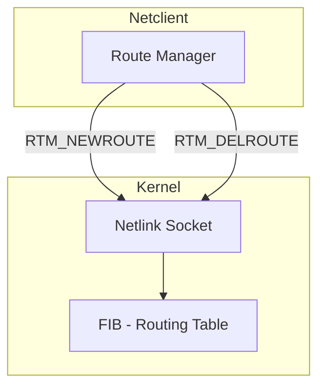

# System Integration

This document describes how Netclient integrates with the operating system at various levels.

## Integration Overview

```
┌─────────────────────────────────────────────────────────────────────────────────┐
│                         SYSTEM INTEGRATION LAYERS                                │
├─────────────────────────────────────────────────────────────────────────────────┤
│                                                                                  │
│  ┌─────────────────────────────────────────────────────────────────────────┐    │
│  │                          NETCLIENT DAEMON                                │    │
│  └───────────────────────────────────┬─────────────────────────────────────┘    │
│                                      │                                           │
│          ┌───────────────────────────┼───────────────────────────┐              │
│          │                           │                           │              │
│          ▼                           ▼                           ▼              │
│  ┌──────────────┐           ┌──────────────┐           ┌──────────────┐         │
│  │  INIT SYSTEM │           │   NETWORK    │           │  DNS SYSTEM  │         │
│  │              │           │    STACK     │           │              │         │
│  │ • systemd    │           │ • WireGuard  │           │ • resolved   │         │
│  │ • sysvinit   │           │ • netlink    │           │ • resolvconf │         │
│  │ • launchd    │           │ • routing    │           │ • Registry   │         │
│  │ • openrc     │           │ • firewall   │           │              │         │
│  └──────────────┘           └──────────────┘           └──────────────┘         │
│          │                           │                           │              │
│          ▼                           ▼                           ▼              │
│  ┌─────────────────────────────────────────────────────────────────────────┐    │
│  │                          OPERATING SYSTEM KERNEL                         │    │
│  │                                                                          │    │
│  │   ┌────────────┐  ┌────────────┐  ┌────────────┐  ┌────────────┐        │    │
│  │   │  Process   │  │  Network   │  │   VFS /    │  │  Crypto    │        │    │
│  │   │  Scheduler │  │  Subsystem │  │   Files    │  │  Module    │        │    │
│  │   └────────────┘  └────────────┘  └────────────┘  └────────────┘        │    │
│  └─────────────────────────────────────────────────────────────────────────┘    │
│                                                                                  │
└─────────────────────────────────────────────────────────────────────────────────┘
```

---

## Init System Integration

### Linux: systemd

Netclient creates a systemd service unit for automatic startup and management.

**Service Unit Location:** `/etc/systemd/system/netclient.service`

```ini
[Unit]
Description=Netclient Daemon
After=network-online.target
Wants=network-online.target

[Service]
Type=simple
ExecStart=/usr/bin/netclient daemon
Restart=on-failure
RestartSec=5s

[Install]
WantedBy=multi-user.target
```

**Lifecycle Management:**



**Commands:**

| Action | Command |
|--------|---------|
| Start | `systemctl start netclient` |
| Stop | `systemctl stop netclient` |
| Restart | `systemctl restart netclient` |
| Status | `systemctl status netclient` |
| Enable | `systemctl enable netclient` |
| Logs | `journalctl -u netclient -f` |

### Linux: sysvinit

**Init Script Location:** `/etc/init.d/netclient`

```bash
#!/bin/sh
### BEGIN INIT INFO
# Provides:          netclient
# Required-Start:    $network $remote_fs
# Required-Stop:     $network $remote_fs
# Default-Start:     2 3 4 5
# Default-Stop:      0 1 6
# Description:       Netclient Daemon
### END INIT INFO

case "$1" in
    start)
        /usr/bin/netclient daemon &
        ;;
    stop)
        killall netclient
        ;;
    restart)
        $0 stop
        $0 start
        ;;
esac
```

### Linux: OpenRC

**Init Script Location:** `/etc/init.d/netclient`

```bash
#!/sbin/openrc-run

name="netclient"
command="/usr/bin/netclient"
command_args="daemon"
command_background=true
pidfile="/run/${RC_SVCNAME}.pid"

depend() {
    need net
    after firewall
}
```

### macOS: launchd

**Plist Location:** `/Library/LaunchDaemons/com.gravitl.netclient.plist`

```xml
<?xml version="1.0" encoding="UTF-8"?>
<!DOCTYPE plist PUBLIC "-//Apple//DTD PLIST 1.0//EN"
    "http://www.apple.com/DTDs/PropertyList-1.0.dtd">
<plist version="1.0">
<dict>
    <key>Label</key>
    <string>com.gravitl.netclient</string>
    <key>ProgramArguments</key>
    <array>
        <string>/Applications/Netclient/netclient</string>
        <string>daemon</string>
    </array>
    <key>RunAtLoad</key>
    <true/>
    <key>KeepAlive</key>
    <true/>
</dict>
</plist>
```

### Windows: Service

Netclient registers as a Windows Service using the `ncWindowsDaemon` wrapper.

**Service Name:** `Netclient`
**Display Name:** `Netclient Daemon`

```
┌─────────────────────────────────────────────────────────────────────────────────┐
│                        WINDOWS SERVICE ARCHITECTURE                              │
├─────────────────────────────────────────────────────────────────────────────────┤
│                                                                                  │
│   ┌─────────────────────────────────────────────────────────────────────────┐   │
│   │                    Windows Service Control Manager                       │   │
│   └───────────────────────────────────┬─────────────────────────────────────┘   │
│                                       │                                          │
│                                       ▼                                          │
│   ┌─────────────────────────────────────────────────────────────────────────┐   │
│   │                    ncWindowsDaemon.exe (Service Host)                    │   │
│   │                                                                          │   │
│   │   • Implements Windows Service interface                                 │   │
│   │   • Handles Start/Stop/Pause/Continue                                    │   │
│   │   • Spawns netclient.exe daemon process                                  │   │
│   │                                                                          │   │
│   └───────────────────────────────────┬─────────────────────────────────────┘   │
│                                       │                                          │
│                                       ▼                                          │
│   ┌─────────────────────────────────────────────────────────────────────────┐   │
│   │                         netclient.exe daemon                             │   │
│   └─────────────────────────────────────────────────────────────────────────┘   │
│                                                                                  │
└─────────────────────────────────────────────────────────────────────────────────┘
```

---

## WireGuard Integration

### Interface Management

```
┌─────────────────────────────────────────────────────────────────────────────────┐
│                        WIREGUARD INTERFACE LIFECYCLE                             │
├─────────────────────────────────────────────────────────────────────────────────┤
│                                                                                  │
│   CREATE                                                                         │
│   ┌─────────────────────────────────────────────────────────────────────────┐   │
│   │                                                                         │   │
│   │   1. Generate or load private key                                       │   │
│   │   2. Create WireGuard interface (nm-{network})                          │   │
│   │   3. Set MTU (default: 1420)                                            │   │
│   │   4. Assign IP addresses (IPv4 and/or IPv6)                             │   │
│   │   5. Set listen port                                                    │   │
│   │   6. Bring interface up                                                 │   │
│   │                                                                         │   │
│   └─────────────────────────────────────────────────────────────────────────┘   │
│                                                                                  │
│   CONFIGURE                                                                      │
│   ┌─────────────────────────────────────────────────────────────────────────┐   │
│   │                                                                         │   │
│   │   For each peer:                                                        │   │
│   │   ├── Set public key                                                    │   │
│   │   ├── Set endpoint (IP:port)                                            │   │
│   │   ├── Set allowed IPs (routes)                                          │   │
│   │   ├── Set persistent keepalive (25 seconds)                             │   │
│   │   └── Set preshared key (optional)                                      │   │
│   │                                                                         │   │
│   └─────────────────────────────────────────────────────────────────────────┘   │
│                                                                                  │
│   DESTROY                                                                        │
│   ┌─────────────────────────────────────────────────────────────────────────┐   │
│   │                                                                         │   │
│   │   1. Remove all peers                                                   │   │
│   │   2. Remove IP addresses                                                │   │
│   │   3. Bring interface down                                               │   │
│   │   4. Delete interface                                                   │   │
│   │                                                                         │   │
│   └─────────────────────────────────────────────────────────────────────────┘   │
│                                                                                  │
└─────────────────────────────────────────────────────────────────────────────────┘
```

### Platform-Specific Implementation

| Platform | Implementation | Driver |
|----------|---------------|--------|
| Linux | `wgctrl-go` + netlink | Kernel module |
| macOS | `wgctrl-go` | wireguard-go (userspace) |
| FreeBSD | `wgctrl-go` | Kernel module (FreeBSD 13+) |
| Windows | `wgctrl-go` | WinTun driver |

### Linux Kernel Module



**Module Loading:**

```bash
# Check if module is loaded
lsmod | grep wireguard

# Load module
modprobe wireguard

# Automatic loading via /etc/modules-load.d/wireguard.conf
```

---

## Firewall Integration

### Linux: nftables

Netclient creates and manages nftables tables, chains, and rules for network access control.

```
┌─────────────────────────────────────────────────────────────────────────────────┐
│                          NFTABLES STRUCTURE                                      │
├─────────────────────────────────────────────────────────────────────────────────┤
│                                                                                  │
│   Table: netmaker                                                                │
│   ┌─────────────────────────────────────────────────────────────────────────┐   │
│   │                                                                         │   │
│   │   Chain: NETMAKER-IN (type filter hook input)                           │   │
│   │   ├── Accept established/related                                        │   │
│   │   ├── Accept from allowed peers                                         │   │
│   │   └── Drop unauthorized                                                 │   │
│   │                                                                         │   │
│   │   Chain: NETMAKER-OUT (type filter hook output)                         │   │
│   │   ├── Accept established/related                                        │   │
│   │   ├── Accept to allowed destinations                                    │   │
│   │   └── Drop unauthorized                                                 │   │
│   │                                                                         │   │
│   │   Chain: NETMAKER-FWD (type filter hook forward)                        │   │
│   │   ├── Accept related traffic                                            │   │
│   │   ├── Accept ingress gateway traffic                                    │   │
│   │   └── Accept egress gateway traffic                                     │   │
│   │                                                                         │   │
│   │   Chain: NETMAKER-NAT (type nat hook postrouting)                       │   │
│   │   └── Masquerade for egress traffic                                     │   │
│   │                                                                         │   │
│   └─────────────────────────────────────────────────────────────────────────┘   │
│                                                                                  │
│   Sets:                                                                          │
│   ┌─────────────────────────────────────────────────────────────────────────┐   │
│   │   • nm-peers-{network}: Allowed peer IP addresses                       │   │
│   │   • nm-egress-{network}: Egress destination ranges                      │   │
│   │   • nm-acl-{network}: ACL-allowed source/dest pairs                     │   │
│   └─────────────────────────────────────────────────────────────────────────┘   │
│                                                                                  │
└─────────────────────────────────────────────────────────────────────────────────┘
```

### Linux: iptables (Legacy)

```
┌─────────────────────────────────────────────────────────────────────────────────┐
│                          IPTABLES STRUCTURE                                      │
├─────────────────────────────────────────────────────────────────────────────────┤
│                                                                                  │
│   Filter Table                                                                   │
│   ┌─────────────────────────────────────────────────────────────────────────┐   │
│   │   INPUT chain                                                           │   │
│   │   └── -j NETMAKER-INPUT                                                 │   │
│   │                                                                         │   │
│   │   FORWARD chain                                                         │   │
│   │   └── -j NETMAKER-FORWARD                                               │   │
│   │                                                                         │   │
│   │   NETMAKER-INPUT chain                                                  │   │
│   │   ├── -m state --state RELATED,ESTABLISHED -j ACCEPT                    │   │
│   │   ├── -i nm-* -s {peer-ip} -j ACCEPT                                    │   │
│   │   └── -i nm-* -j DROP                                                   │   │
│   │                                                                         │   │
│   │   NETMAKER-FORWARD chain                                                │   │
│   │   ├── -i nm-* -o eth0 -j ACCEPT  (egress)                               │   │
│   │   └── -i eth0 -o nm-* -j ACCEPT  (ingress)                              │   │
│   └─────────────────────────────────────────────────────────────────────────┘   │
│                                                                                  │
│   NAT Table                                                                      │
│   ┌─────────────────────────────────────────────────────────────────────────┐   │
│   │   POSTROUTING chain                                                     │   │
│   │   └── -j NETMAKER-POSTROUTING                                           │   │
│   │                                                                         │   │
│   │   NETMAKER-POSTROUTING chain                                            │   │
│   │   └── -s {network-cidr} -o {ext-iface} -j MASQUERADE                    │   │
│   └─────────────────────────────────────────────────────────────────────────┘   │
│                                                                                  │
└─────────────────────────────────────────────────────────────────────────────────┘
```

### ACL Rule Application Flow



---

## DNS Integration

### Linux: systemd-resolved

```
┌─────────────────────────────────────────────────────────────────────────────────┐
│                      SYSTEMD-RESOLVED INTEGRATION                                │
├─────────────────────────────────────────────────────────────────────────────────┤
│                                                                                  │
│   ┌─────────────────────────────────────────────────────────────────────────┐   │
│   │                         Netclient DNS Manager                            │   │
│   └───────────────────────────────────┬─────────────────────────────────────┘   │
│                                       │                                          │
│                                       │ D-Bus                                    │
│                                       ▼                                          │
│   ┌─────────────────────────────────────────────────────────────────────────┐   │
│   │                        systemd-resolved                                  │   │
│   │                                                                          │   │
│   │   Per-interface DNS configuration:                                       │   │
│   │   ┌─────────────────────────────────────────────────────────────────┐   │   │
│   │   │   Interface: nm-mynet                                            │   │   │
│   │   │   DNS Servers: 10.10.10.1                                        │   │   │
│   │   │   Search Domains: mynet.netmaker                                 │   │   │
│   │   │   DNSSEC: no                                                     │   │   │
│   │   │   Default Route: no                                              │   │   │
│   │   └─────────────────────────────────────────────────────────────────┘   │   │
│   │                                                                          │   │
│   └───────────────────────────────────┬─────────────────────────────────────┘   │
│                                       │                                          │
│                                       ▼                                          │
│   ┌─────────────────────────────────────────────────────────────────────────┐   │
│   │                         /etc/resolv.conf                                 │   │
│   │   (symlinked to /run/systemd/resolve/stub-resolv.conf)                  │   │
│   │                                                                          │   │
│   │   nameserver 127.0.0.53                                                  │   │
│   │   options edns0 trust-ad                                                 │   │
│   │   search mynet.netmaker                                                  │   │
│   │                                                                          │   │
│   └─────────────────────────────────────────────────────────────────────────┘   │
│                                                                                  │
└─────────────────────────────────────────────────────────────────────────────────┘
```

### Linux: resolvconf

```bash
# Netclient updates DNS via resolvconf
echo "nameserver 10.10.10.1" | resolvconf -a nm-mynet
echo "search mynet.netmaker" | resolvconf -a nm-mynet

# Cleanup on leave
resolvconf -d nm-mynet
```

### Linux: Direct /etc/resolv.conf

When no DNS manager is available, Netclient directly modifies `/etc/resolv.conf`:

```
# Managed by Netclient
nameserver 10.10.10.1
search mynet.netmaker

# Original configuration preserved below
nameserver 8.8.8.8
nameserver 8.8.4.4
```

### Built-in DNS Server

Netclient runs a local DNS server for network-specific resolution:

```
┌─────────────────────────────────────────────────────────────────────────────────┐
│                        NETCLIENT DNS SERVER                                      │
├─────────────────────────────────────────────────────────────────────────────────┤
│                                                                                  │
│   ┌─────────────────────────────────────────────────────────────────────────┐   │
│   │                      DNS Listener (UDP :53)                              │   │
│   └───────────────────────────────────┬─────────────────────────────────────┘   │
│                                       │                                          │
│                                       ▼                                          │
│   ┌─────────────────────────────────────────────────────────────────────────┐   │
│   │                         Query Router                                     │   │
│   │                                                                          │   │
│   │   Query: node1.mynet.netmaker                                            │   │
│   │          ↓                                                               │   │
│   │   Match domain suffix?                                                   │   │
│   │          ↓                                                               │   │
│   │   ┌─────────────────┬─────────────────┐                                 │   │
│   │   │      YES        │       NO        │                                 │   │
│   │   │   ↓             │       ↓         │                                 │   │
│   │   │ Local resolve   │ Forward to      │                                 │   │
│   │   │ from cache      │ upstream DNS    │                                 │   │
│   │   └─────────────────┴─────────────────┘                                 │   │
│   │                                                                          │   │
│   └─────────────────────────────────────────────────────────────────────────┘   │
│                                                                                  │
│   DNS Records (from server sync):                                                │
│   ┌─────────────────────────────────────────────────────────────────────────┐   │
│   │   node1.mynet.netmaker    A      10.10.10.5                              │   │
│   │   node2.mynet.netmaker    A      10.10.10.6                              │   │
│   │   node1.mynet.netmaker    AAAA   fd00::5                                 │   │
│   │   5.10.10.10.in-addr.arpa PTR    node1.mynet.netmaker                    │   │
│   └─────────────────────────────────────────────────────────────────────────┘   │
│                                                                                  │
└─────────────────────────────────────────────────────────────────────────────────┘
```

---

## Routing Integration

### Linux: netlink



**Route Types:**

| Route Type | Description | Example |
|------------|-------------|---------|
| Peer route | Direct route to peer | `10.10.10.5/32 via nm-mynet` |
| Network route | Allowed IP ranges | `192.168.1.0/24 via nm-mynet` |
| Egress route | External network access | `0.0.0.0/0 via 10.10.10.1` |

### macOS/FreeBSD: route command

```bash
# Add route
route -n add -net 10.10.10.0/24 -interface utun5

# Delete route
route -n delete -net 10.10.10.0/24

# View routes
netstat -rn
```

### Windows: Route API

```powershell
# Routes managed via Windows API
# Equivalent commands:
route add 10.10.10.0 mask 255.255.255.0 10.10.10.1
route delete 10.10.10.0
```

---

## IP Forwarding

Netclient enables IP forwarding when acting as a gateway.

### Linux

```bash
# Enable IPv4 forwarding
sysctl -w net.ipv4.ip_forward=1

# Enable IPv6 forwarding
sysctl -w net.ipv6.conf.all.forwarding=1

# Persist in /etc/sysctl.d/99-netclient.conf
```

### FreeBSD

```bash
# Enable forwarding
sysctl net.inet.ip.forwarding=1
sysctl net.inet6.ip6.forwarding=1
```

### macOS

```bash
# Enable forwarding
sysctl -w net.inet.ip.forwarding=1
```

---

## File System Layout

### Linux

```
/etc/netclient/
├── netclient.json      # Host configuration
├── nodes.json          # Network nodes
├── servers.json        # Server configurations
├── dns.json            # DNS configuration
├── .serverctx          # Current server context
└── *.lock              # Lock files

/var/log/
└── netclient.log       # Log file (when not using journald)

/usr/bin/
└── netclient           # Binary

/etc/systemd/system/
└── netclient.service   # Systemd unit
```

### macOS

```
/Applications/Netclient/
├── netclient           # Binary
├── netclient.json      # Configuration
├── nodes.json
├── servers.json
└── dns.json

/Library/LaunchDaemons/
└── com.gravitl.netclient.plist
```

### Windows

```
C:\Program Files (x86)\Netclient\
├── netclient.exe
├── ncWindowsDaemon.exe
├── netclient.json
├── nodes.json
├── servers.json
└── dns.json

C:\ProgramData\Netclient\
└── logs\
    └── netclient.log
```

---

## Related Documentation

- [Architecture](Architecture) - System architecture overview
- [Workflows](Workflows) - Process flow diagrams
- [Components](Components) - Package details
- [Configuration](Configuration) - Config file formats
