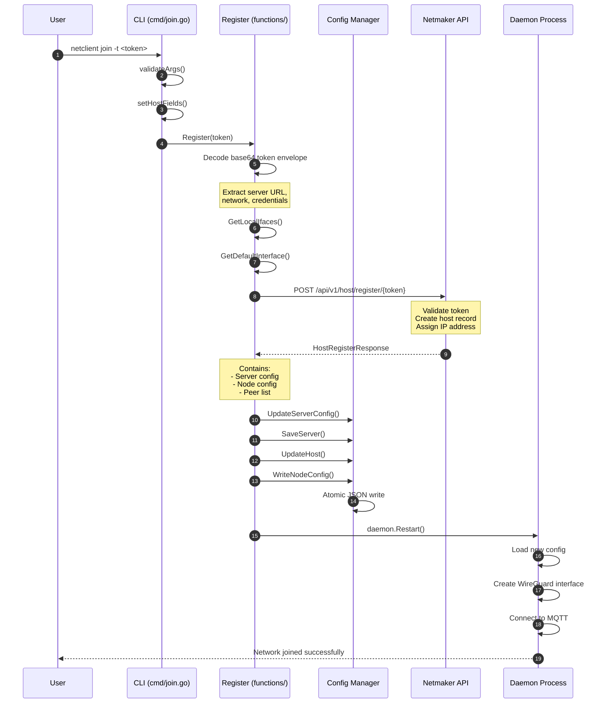
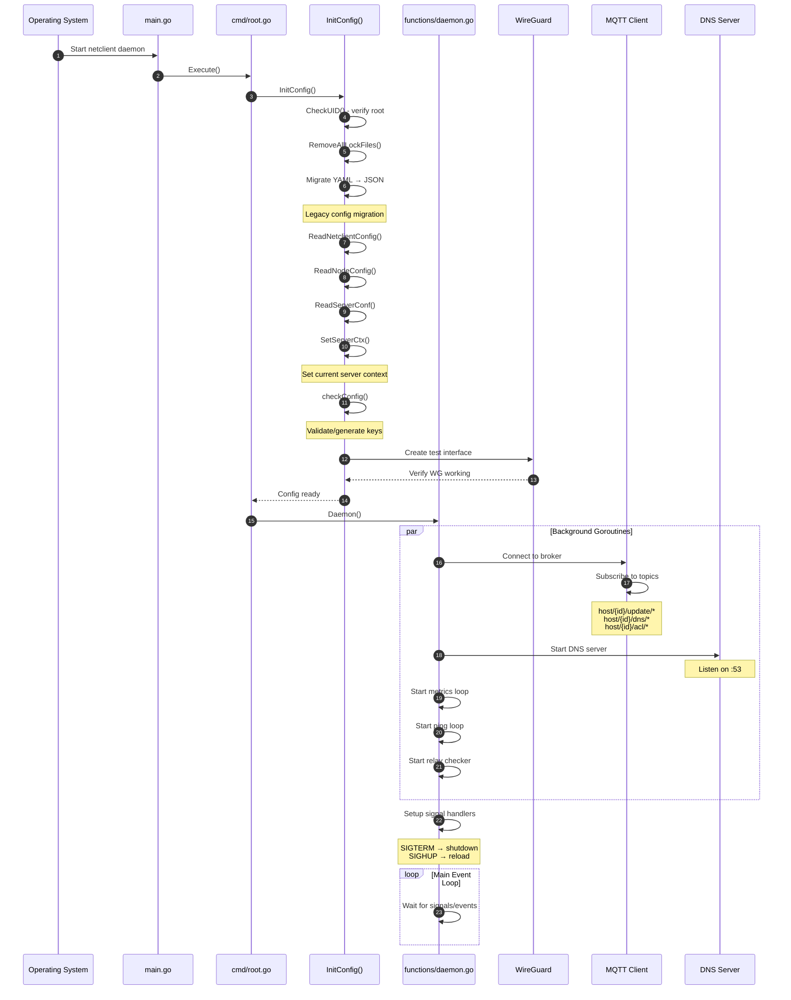
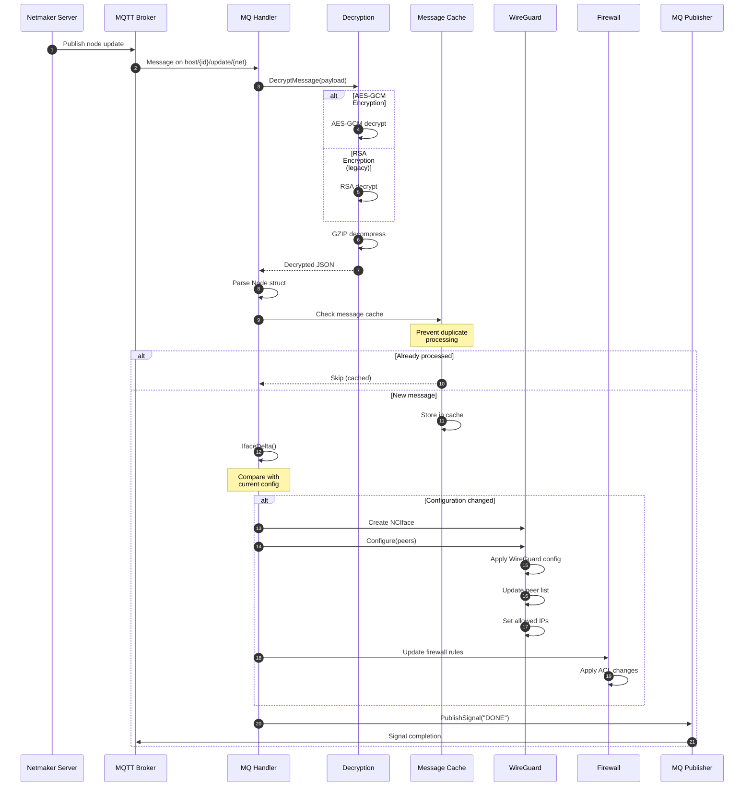
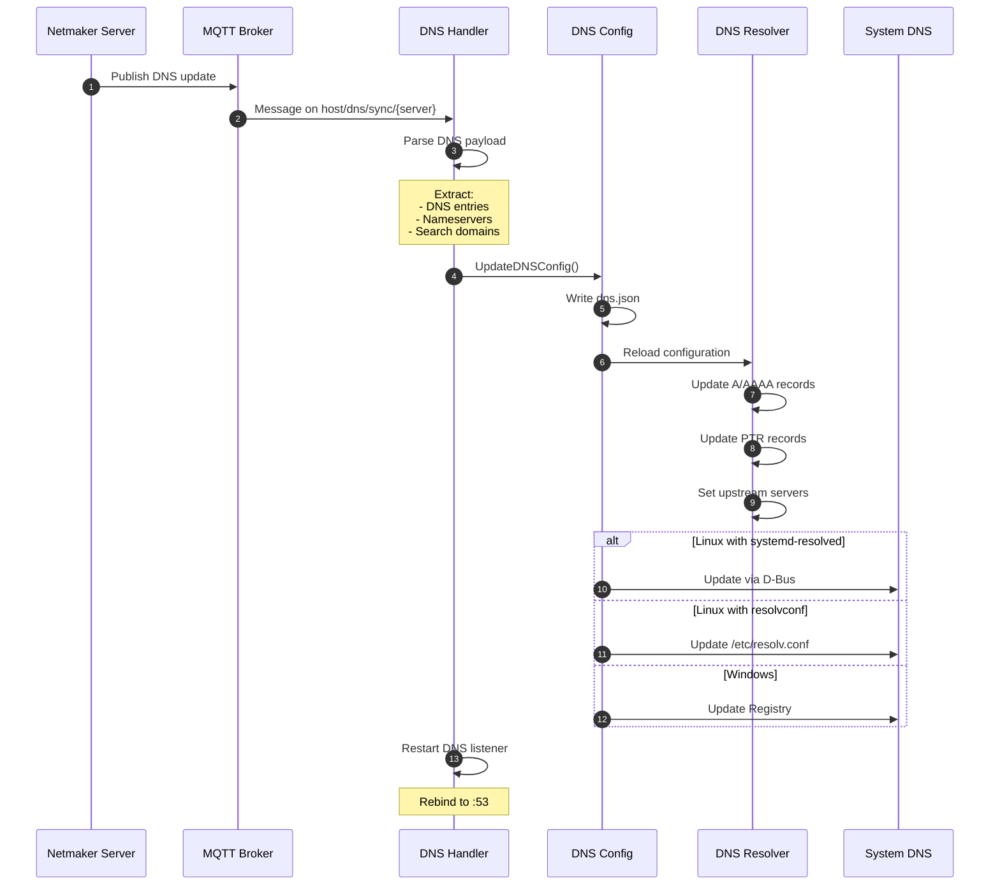
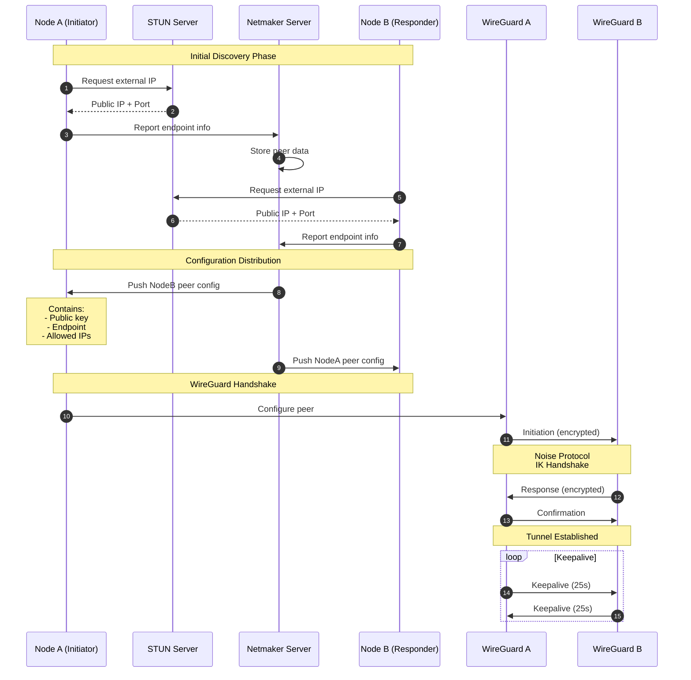
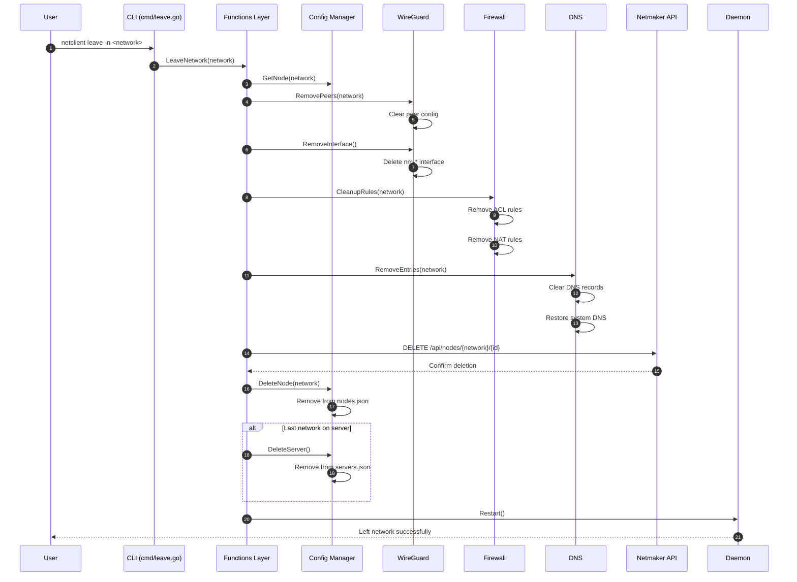
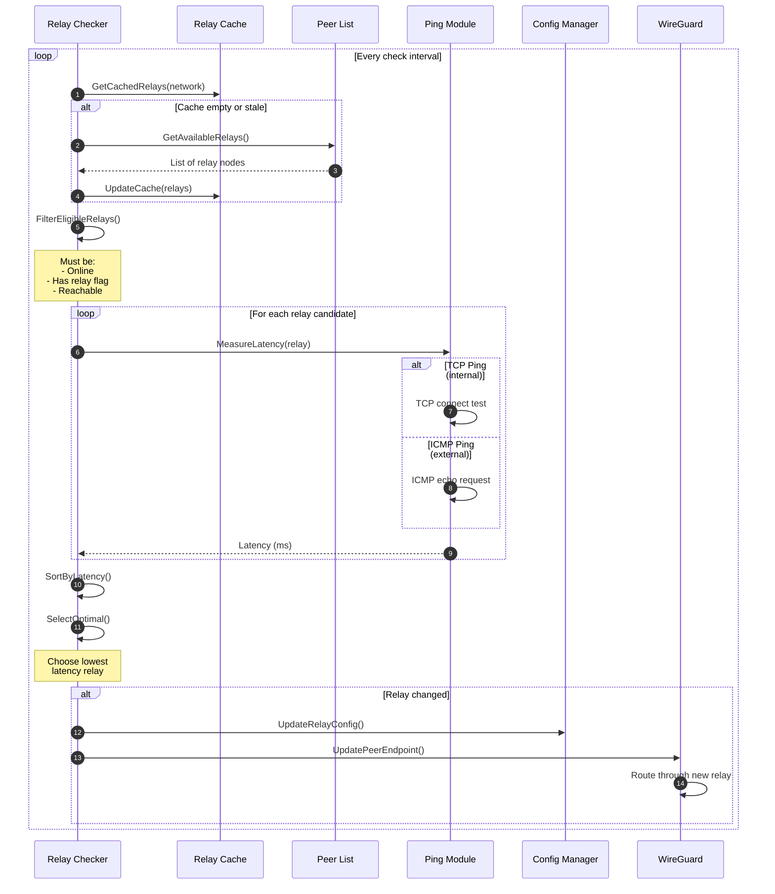
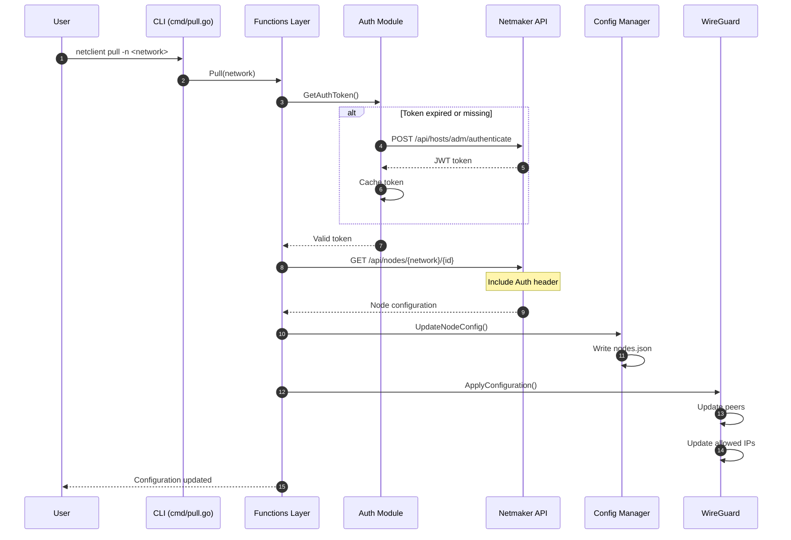

# Workflows

This document contains swimlane diagrams for key Netclient workflows.

## Table of Contents

- [Join Network Flow](#join-network-flow)
- [Daemon Startup Flow](#daemon-startup-flow)
- [Node Update Flow](#node-update-flow)
- [DNS Synchronization Flow](#dns-synchronization-flow)
- [Peer Connection Flow](#peer-connection-flow)
- [Leave Network Flow](#leave-network-flow)
- [Auto-Relay Selection Flow](#auto-relay-selection-flow)

---

## Join Network Flow

This diagram shows the complete flow when a user joins a new network.



**Detailed Steps:**

| Step | Component | Action |
|------|-----------|--------|
| 1 | CLI | Parse command arguments, validate token format |
| 2 | CLI | Set host fields (name, interfaces, endpoints) |
| 3-4 | Register | Decode base64 envelope containing server URL and credentials |
| 5-6 | Register | Discover local network interfaces |
| 7-8 | API | Register host with Netmaker server |
| 9-12 | Config | Persist server, node, and host configuration |
| 13-16 | Daemon | Restart daemon to apply new configuration |

---

## Daemon Startup Flow

This diagram shows the daemon initialization sequence.



**Goroutine Overview:**

```
┌─────────────────────────────────────────────────────────────────────────────────┐
│                           DAEMON GOROUTINES                                      │
├─────────────────────────────────────────────────────────────────────────────────┤
│                                                                                  │
│  ┌─────────────────────────────────────────────────────────────────────────┐    │
│  │                         MAIN GOROUTINE                                   │    │
│  │                                                                          │    │
│  │   • Configuration initialization                                         │    │
│  │   • Signal handling (SIGTERM, SIGHUP)                                   │    │
│  │   • Graceful shutdown coordination                                       │    │
│  │                                                                          │    │
│  └─────────────────────────────────────────────────────────────────────────┘    │
│                                                                                  │
│  ┌───────────────┐ ┌───────────────┐ ┌───────────────┐ ┌───────────────┐        │
│  │ MQTT Handler  │ │ Metrics Loop  │ │  Ping Loop    │ │ Relay Checker │        │
│  │               │ │               │ │               │ │               │        │
│  │ • Message rx  │ │ • Collect     │ │ • ICMP ping   │ │ • Test relays │        │
│  │ • Dispatch    │ │ • Report      │ │ • TCP ping    │ │ • Select best │        │
│  │ • Update cfg  │ │ • Every 5min  │ │ • Every 30s   │ │ • Update peer │        │
│  └───────────────┘ └───────────────┘ └───────────────┘ └───────────────┘        │
│                                                                                  │
│  ┌───────────────┐                                                               │
│  │  DNS Server   │                                                               │
│  │               │                                                               │
│  │ • UDP :53     │                                                               │
│  │ • Resolve     │                                                               │
│  │ • Forward     │                                                               │
│  └───────────────┘                                                               │
│                                                                                  │
└─────────────────────────────────────────────────────────────────────────────────┘
```

---

## Node Update Flow

This diagram shows how configuration updates are processed via MQTT.



**Message Flow Detail:**

```
┌────────────────────────────────────────────────────────────────────────────────┐
│                          NODE UPDATE MESSAGE FLOW                               │
├────────────────────────────────────────────────────────────────────────────────┤
│                                                                                 │
│   INCOMING MESSAGE                                                              │
│   ┌─────────────────────────────────────────────────────────────────────────┐  │
│   │                                                                         │  │
│   │   Topic: host/{host-id}/update/{network}                                │  │
│   │                                                                         │  │
│   │   Payload (encrypted + compressed):                                     │  │
│   │   ┌─────────────────────────────────────────────────────────────────┐  │  │
│   │   │  AES-GCM(GZIP(JSON))                                            │  │  │
│   │   │                                                                  │  │  │
│   │   │  Decrypted JSON:                                                 │  │  │
│   │   │  {                                                               │  │  │
│   │   │    "network": "mynet",                                           │  │  │
│   │   │    "address": "10.10.10.5/24",                                   │  │  │
│   │   │    "peers": [...],                                               │  │  │
│   │   │    "dns_on": true,                                               │  │  │
│   │   │    "is_egress": false,                                           │  │  │
│   │   │    ...                                                           │  │  │
│   │   │  }                                                               │  │  │
│   │   └─────────────────────────────────────────────────────────────────┘  │  │
│   └─────────────────────────────────────────────────────────────────────────┘  │
│                                                                                 │
│   PROCESSING PIPELINE                                                           │
│   ┌─────────┐   ┌─────────┐   ┌─────────┐   ┌─────────┐   ┌─────────┐         │
│   │ Receive │──►│ Decrypt │──►│Decomprss│──►│  Parse  │──►│  Apply  │         │
│   │         │   │ AES-GCM │   │  GZIP   │   │  JSON   │   │  Config │         │
│   └─────────┘   └─────────┘   └─────────┘   └─────────┘   └─────────┘         │
│                                                                                 │
└────────────────────────────────────────────────────────────────────────────────┘
```

---

## DNS Synchronization Flow



---

## Peer Connection Flow



**NAT Traversal Decision Tree:**

```
┌─────────────────────────────────────────────────────────────────────────────────┐
│                          NAT TRAVERSAL DECISION                                  │
├─────────────────────────────────────────────────────────────────────────────────┤
│                                                                                  │
│                          ┌───────────────┐                                       │
│                          │  Both peers   │                                       │
│                          │  have public  │                                       │
│                          │     IPs?      │                                       │
│                          └───────┬───────┘                                       │
│                                  │                                               │
│                    ┌─────────────┴─────────────┐                                │
│                    │                           │                                │
│                   YES                          NO                               │
│                    │                           │                                │
│                    ▼                           ▼                                │
│           ┌───────────────┐          ┌───────────────┐                          │
│           │ Direct P2P    │          │  NAT type     │                          │
│           │ connection    │          │  compatible?  │                          │
│           └───────────────┘          └───────┬───────┘                          │
│                                              │                                   │
│                                ┌─────────────┴─────────────┐                    │
│                                │                           │                    │
│                               YES                          NO                   │
│                                │                           │                    │
│                                ▼                           ▼                    │
│                       ┌───────────────┐          ┌───────────────┐              │
│                       │  UDP hole     │          │   Use relay   │              │
│                       │  punching     │          │     node      │              │
│                       └───────────────┘          └───────┬───────┘              │
│                                                          │                      │
│                                                          ▼                      │
│                                                 ┌───────────────┐               │
│                                                 │ Select best   │               │
│                                                 │ relay by      │               │
│                                                 │ latency       │               │
│                                                 └───────────────┘               │
│                                                                                  │
└─────────────────────────────────────────────────────────────────────────────────┘
```

---

## Leave Network Flow



---

## Auto-Relay Selection Flow



**Relay Selection Criteria:**

```
┌─────────────────────────────────────────────────────────────────────────────────┐
│                          RELAY SELECTION CRITERIA                                │
├─────────────────────────────────────────────────────────────────────────────────┤
│                                                                                  │
│   ELIGIBILITY REQUIREMENTS                                                       │
│   ┌─────────────────────────────────────────────────────────────────────────┐   │
│   │                                                                         │   │
│   │   1. Node has relay capability flag set                                 │   │
│   │   2. Node is currently online (recent heartbeat)                        │   │
│   │   3. Node has public IP or reachable endpoint                          │   │
│   │   4. Node is on same network                                           │   │
│   │                                                                         │   │
│   └─────────────────────────────────────────────────────────────────────────┘   │
│                                                                                  │
│   SELECTION ALGORITHM                                                            │
│   ┌─────────────────────────────────────────────────────────────────────────┐   │
│   │                                                                         │   │
│   │   for each eligible_relay:                                              │   │
│   │       latency = measure_tcp_ping(relay.endpoint)                        │   │
│   │       if latency < best_latency:                                        │   │
│   │           best_relay = relay                                            │   │
│   │           best_latency = latency                                        │   │
│   │                                                                         │   │
│   │   if best_relay != current_relay:                                       │   │
│   │       switch_to_relay(best_relay)                                       │   │
│   │                                                                         │   │
│   └─────────────────────────────────────────────────────────────────────────┘   │
│                                                                                  │
│   LATENCY THRESHOLDS                                                             │
│   ┌─────────────────────────────────────────────────────────────────────────┐   │
│   │                                                                         │   │
│   │   Excellent:  < 50ms   │  Good:  50-100ms  │  Acceptable:  100-200ms   │   │
│   │   Poor:      200-500ms │  Bad:    > 500ms  │  Timeout:     > 2000ms    │   │
│   │                                                                         │   │
│   └─────────────────────────────────────────────────────────────────────────┘   │
│                                                                                  │
└─────────────────────────────────────────────────────────────────────────────────┘
```

---

## Configuration Pull Flow



---

## Related Documentation

- [Architecture](Architecture) - Component architecture diagrams
- [System Integration](System-Integration) - OS-level integration
- [Components](Components) - Detailed package breakdown
- [Configuration](Configuration) - Config file formats
